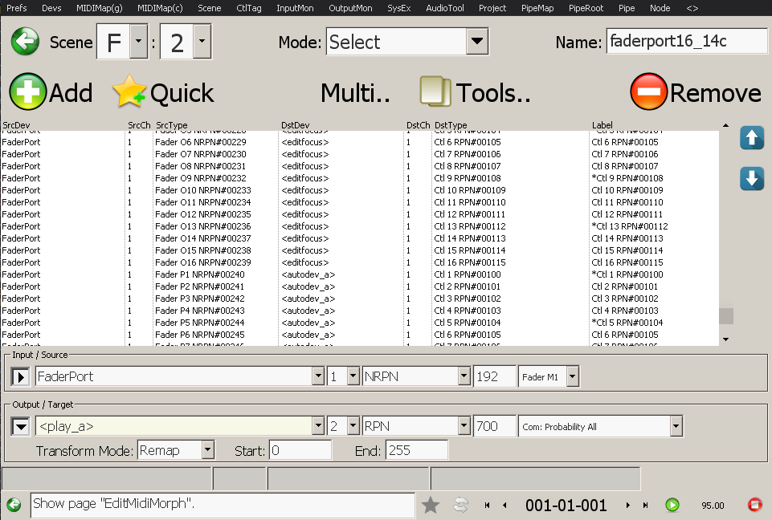

% Synergy MIDI Tracker - FaderPort 8/16
% bsp
% 31-Dec-2021
>>>
19Dec2021, 23Dec2021, 31Dec2021
<<<
$(var:header)

# Table of Contents
$(buf!toc)

# PreSonus FaderPort support

## Features

- 16 banks * 16 faders (FaderPort 16), or 8 banks * faders (FaderPort 8)
- Fader-locking (fader returns to original value after moving it)
- Detail-edit mode (hold `M` and move a fader)
- User defined labels (up to 14 chars)
- Automatic label assignment (queries Eureka ModMatrix to find VST parameter names, or import from MIDI synth profile)
- Fadder-tagging / Label markers (invert last line)
- Temporary fader bank states (quick-save / reload)
- MIDI-mappable buttons
- Context-sensitive editing (Tracker and Modular nodes)
- Fader states are saved in project file

## Setup

The FaderPort input and output devices must be enabled and their aliases (`Devs` page) must be set to `FaderPort`.
The Channel Profiles must be set to `PreSonus FaderPort`.

On the `Prefs` page `Misc` tab, select your FaderPort Model (8 or 16).

The `Detail-Edit Precision` setting determines the fader range in detail-edit mode. The highest precision has the lowest range.

Save the configuration, then restart the application.

tip: the auto-loaded default / example project in the Synergy release should work with a FaderPort 16 out-of-the-box

## FaderPort controls

|:HW Button                |:Description
|                   Select | Switch to Bank 1..16 (A...P)
|     touch fader + Select | Toggle label marker (invert last line)
|           Shift + Select | Toggle fader lock
|                        M | Hold for fader detail-edit mode (up to 14bit)
|                        S | Reset fader to center, max, or min position (0x2000 / 8192, 0x3FFF / 16383, 0)
|                      ARM | Save temporary bank fader states
|              Shift + ARM | Swap current / temporary bank fader states
|               Solo Clear | Undo last fader change
|               Mute Clear | Query labels from Eureka ModMatrix (VST) parameter names, or MIDI synth profile
|                   Bypass | Update current bank faders from output state (all scene groups)
|                    Macro | Resend all current bank faders via MIDI Morph Scene
|                     Link | Toggle fader lock (all current bank faders)
|                    Shift | Temporarily display bank names (A..P)
] FaderPort HW buttons

The remaining (right-hand side) buttons and the two encoders can be mapped on the MIDIMap pages (global and context sensitive).

### Recommended MIDI-map assignments

The following HW control mappings can be assigned on the `MIDIMap(g)` and `MIDIMap(c)` pages:

|:HW Button                | Map Target               |:Description
|             EncPan Click | `GLOBAL_YES`              | Click focused UI button
|             EncNav Click | `GLOBAL_YES`              | Click focused UI button
|                     Prev | `GLOBAL_PAGE_PREV`        | Go to previous page
|                    Latch | `GLOBAL_SCENE_F_1`        | Select scene F1
|                      Off | `GLOBAL_SCENE_F_2`        | Select scene F2
|                Enc#2 Nav | `GLOBAL_FOCUS_DELTA`      | Cycle UI widget keyboard focus
|                Enc#1 Pan | `GLOBAL_VALUE_DELTA`      | Edit focused UI widget (inc/dec)
|                    Touch | `NAV_NODE_PREV`          | Edit previous node
|                     Read | `NAV_NODE_NEXT`          | Edit next node
|                     Trim | `NAV_PIPE_PREV`          | Edit last-selected node of previous pipe
|                    Write | `NAV_PIPE_NEXT`          | Edit last-selected node of next pipe
|                     Play | `TRANSPORT_PLAY`          | Start / Stop replay
|                     Stop | `TRANSPORT_STOP`         | Stop replay
|                     Loop | `TRANSPORT_CYCLE`        | Toggle song loop (cycle)
|                   Rewind | `TRANSPORT_MARKER_PREV`   | Go to previous song marker
|                  Forward | `TRANSPORT_MARKER_NEXT`   | Go to next song marker
|                    Click | `TOGGLE_METRONOME`        | Toggle metronome click
] FaderPort Global HW buttons MIDIMap

|:HW Button                | Map Target               |:Description
|                Enc#2 Nav | `CURSOR_TRACK_CTL_DELTA`   | Cycle through track controller envelopes
] FaderPort Tracker node HW buttons MIDIMap

## FaderPort MIDI events

The faders send NRPN MIDI events #1..#256 (grouped in 16 banks).

## FaderPort MIDI Morph Scene

When selecting a scene that references one or many fader NRPN events, the corresponding fader(s) will be restored to the last seen value(s).

Vice versa, moving a fader will transform the fader NRPN to the matching scene entry's target port and type.

### Resending events
Pressing the `Macro` key resends the scene-transformed output events for the currently selected bank.
tip: this can be useful when switching between alternative FaderPort scenes or when recording multiple events to a sequencer step

### Example scenes
Two example scene setups (`.mms` files) are included in the release:

#### faderport16
|:Bank  |:Description
| A     | Controls currently selected Eureka track and currently edited sequencer node.
| B     | Controls vst_a channel 1 performance controllers and RPN 100..107 (`Ctl1`..`Ctl8`) (default Eureka ModMatrix source events)
| C     | Controls vst_a channel 2 performance controllers and RPN 100..107 (`Ctl1`..`Ctl8`) (default Eureka ModMatrix source events)
| D     | Controls vst_b channel 1 performance controllers and RPN 100..107 (`Ctl1`..`Ctl8`) (default Eureka ModMatrix source events)
| E     | Controls vst_b channel 2 performance controllers and RPN 100..107 (`Ctl1`..`Ctl8`) (default Eureka ModMatrix source events)
| F     | Controls vst_c channel 1 performance controllers and RPN 100..107 (`Ctl1`..`Ctl8`) (default Eureka ModMatrix source events)
| G     | Controls vst_c channel 2 performance controllers and RPN 100..107 (`Ctl1`..`Ctl8`) (default Eureka ModMatrix source events)
| H     | Controls vst_d channel 1..4 pitchbend+modwheel+ RPN 100+101 (`Ctl1`+`Ctl2`) (default Eureka ModMatrix source events)
| I     | Controls vst_d channel 5..8 pitchbend+modwheel+ RPN 100+101 (`Ctl1`+`Ctl2`) (default Eureka ModMatrix source events)
| J     | Controls vst_d channel 1..8 pitchbend+modwheel
| K     | Controls Analog Rytm performance controllers 1..12
| L     | -
| M     | -
| N     | -
| O     | -
| P     | Controls `<autodev_a>` RPN 100..107 (`Ctl1`..`Ctl8`) (context sensitive, redirected to current node automation port A)
] faderport16 .mms preset scene banks (8 hi-res RPN controls)

#### faderport16_14c
|:Bank  |:Description
| A     | Controls currently selected Eureka track and currently edited sequencer node.
| B     | Controls vst_a channel 1 pitchbend+modwheel and RPN 100..113 (`Ctl1`..`Ctl14`) (default Eureka ModMatrix source events)
| C     | Controls vst_a channel 2 pitchbend+modwheel and RPN 100..113 (`Ctl1`..`Ctl14`) (default Eureka ModMatrix source events)
| D     | Controls vst_b channel 1 pitchbend+modwheel and RPN 100..113 (`Ctl1`..`Ctl14`) (default Eureka ModMatrix source events)
| E     | Controls vst_b channel 2 pitchbend+modwheel and RPN 100..113 (`Ctl1`..`Ctl14`) (default Eureka ModMatrix source events)
| F     | Controls vst_c channel 1 pitchbend+modwheel and RPN 100..113 (`Ctl1`..`Ctl14`) (default Eureka ModMatrix source events)
| G     | Controls vst_c channel 2 pitchbend+modwheel and RPN 100..113 (`Ctl1`..`Ctl14`) (default Eureka ModMatrix source events)
| H     | Controls vst_d channel 1..4 pitchbend+modwheel+ RPN 100+101 (`Ctl1`+`Ctl2`) (default Eureka ModMatrix source events)
| I     | Controls vst_d channel 5..8 pitchbend+modwheel+ RPN 100+101 (`Ctl1`+`Ctl2`) (default Eureka ModMatrix source events)
| J     | Controls vst_d channel 1..8 pitchbend+modwheel
| K     | Controls Analog Rytm performance controllers 1..12
| L     | -
| M     | -
| N     | -
| O     | -
| P     | Controls `<autodev_a>` RPN 100..107 (`Ctl1`..`Ctl8`) (context sensitive, redirected to current node automation port A)
] faderport16_14c .mms preset scene banks (14 hi-res RPN controls)

TIP: press F12 to add a Eureka ModMatrix entry for the last touched VST editor widget (RPN 100..113).

TIP: the `<autodev_a>` and `<autodev_b>` (virtual) MIDI devices will be translated to the actual automation port A / B device when a node editor is visible. The behaviour is node-type dependent: In the `Tracker` editor, RPNs 100..115 (`Ctl1`..`Ctl16`) will be mapped to the current instrument's usrctls 1..16. In the `Modular` editor, the RPNs will be mapped to "autorpnslider" modules. In the `CtlMorph` editor, they will be mapped to the first 16 entry center values of the current group. All remaining RPNs (as defined in `midi_synth_profiles/internal.msp`) will be used as-is (e.g. morph positions, step probabilities, ..).

The example scenes can be loaded via the `Load Scene` tools menu option on the `Scene` page (or by pressing `lctrl-l`).

## Manual label editing

To change a fader label, edit the MIDI morph scene, select an entry and either press `F2` or right-click on the `Label` column.

Labels that begin with `*` will automatically be marked (last line will be inverted).

Labels that end with the string `_PB` will cause the fader to be locked to the center position (pitchbend mode).

When a label contains the `,` character, it will be force-split into multiple lines.

tip: manually editing a label sets its _base_ caption which the label will revert to if it is not currently assigned an automatic caption

## Automatic label queries

### Eureka ModMatrix (VST)
Labels can be auto-assigned the names of the (VST) parameters the corresponding fader currently controls.

note: This is done by querying the Eureka ModMatrix entries and finding those that correspond to the MIDI morph scene entry port and type (target event), and the fader (source event FaderPort device NRPNs 1..256).

Either go to the `Scene` page, (multi-)select the entries that shall be updated, then press `lctrl-f` (or choose `Query Eureka ModMatrix Labels` from the `Tools` menu), or simply press the `Mute Clear` button on the FaderPort to update the labels for all faders.

### MIDI Synth Profile Import (HW)
This works similar to VST label queries with the difference that the labels are determined by MIDI Synth Profile controller aliases.

Go to the `Scene` page, move the cursor to an entry that matches the desired output device+channel (this is used to determine the MIDI synth profile), then press `lshift-f` (or choose `Import From MIDI Synth Profile..` from the `Tools` menu).

note: the imported aliases / scene entries will be auto-adjusted (remapped) to their actual parameter ranges

#### Replace mode
When one or more scene entries are selected (_not_ counting the table cursor row), the selected target event's device / channel / type will be replaced by the imported MIDI synth profile controller aliases.

#### Add mode (FaderPort)
When no scene entries are selected, and the table cursor row source event device is `FaderPort`, the imported MIDI synth profile controller aliases will be added to the scene.

When the table cursor row source event type is `NRPN`, it determines the fader bank and fader offset for the imported entries.
If the type is _not_ `NRPN`, the imported entries start at the first fader of the first bank (A1).

Up to 16*16=256 MIDI Synth Profile aliases can be imported / auto-assigned to the faders (banks A..P).

## Context-sensitive fader editing

Faders that have been assigned the (virtual) target device `<editfocus>` and target type `RPN` 100..131 (`Ctl 1` .. `Ctl 32`) on the `Scene` page can be used as bidirectional, context-sensitive editing controls.

important: make sure that one of the internal, virtual MIDI devices is assigned the alias `<editfocus>` (see `Devs` page)

] FaderPort Scene configuration example

### Modular Node
`<editfocus>` faders will be assigned the parameters of the currently selected (keyboard-focused) module.

This is especially useful with the `CVSeq16`, `TrigSeq16`, and `Voltage Memory` modules: The faders can be used for editing the sequence steps, similar to a hardware sequencer like the ARP 1601.

The (big) navigation encoder should be mapped to the `GLOBAL_FOCUS_DELTA` target in the global MIDIMap context (see above) so it can be used to cycle through the modules.

The fader labels will display the current module parameter names.

### Tracker Node
`<editfocus>` faders will be assigned the step values of the first 16 events of the currently selected pattern column.

The (big) navigation encoder should be mapped to the `CURSOR_TRACK_CTL_DELTA` target in the Tracker node MIDIMap context (see above) so it can be used to cycle through the track envelopes.

The fader labels will display the current envelope (short) name, and event positions (sixteenth note offsets).

important: keep in mind that the first 16 _events_ will be displayed, _not_ the first 16 steps, i.e. the faders are used for editing _existing_ events, regardless of the actual pattern length.

$(buf!footnote)
$(buf!w3validator)

Document created in $(var:gen_ms) on $(var:localdatetime)
].create
