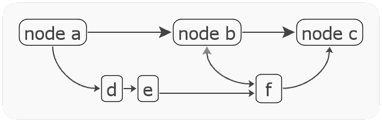
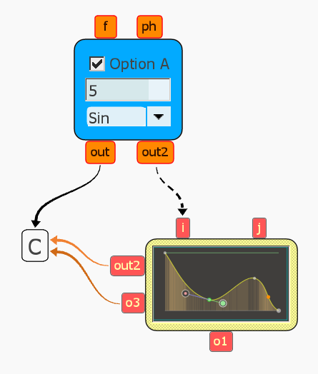

`Graph` is a free open-source diagram and graph generator, with the main focus being diagrams.

It is meant to be used as a (headless) command line utility that reads `.gr` text files and outputs `.svg` / `.html`. It also comes with a built-in OpenGL preview mode.

While the `.gr` syntax is loosely based on [Graphviz "dot"](https://graphviz.org/), the focus is on the visual presentation of diagrams and smaller graphs, rather than the auto-layouting of large datasets.

The `GraphForm` widget is part of [tkui](../../../tkui) and can also embed other UI widgets:

