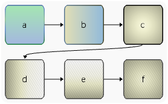

% Graph
% bsp
% 23-Feb-2025
>>>
02Apr2024, 03Apr2024, 04Apr2024, 05Apr2024, 06Apr2024, 07Apr2024, 08Apr2024, 09Apr2024, 10Apr2024, 13Apr2024, 18Feb2025, 23Feb2025
<<<
$(var:header)

# Table of Contents
$(buf!toc)

# About

`Graph` is a free open-source diagram and graph generator, with the main focus being diagrams.

It is meant to be used as a (headless) command line utility that reads `.gr` text files and outputs `.svg` / `.html`. It also comes with a built-in OpenGL preview mode.

While the `.gr` syntax is loosely based on [Graphviz "dot"](https://graphviz.org/), the focus is on the visual presentation of diagrams and smaller graphs, rather than the auto-layouting of large datasets.

`Graph` is written in [TkScript](http://tkscript.org) and is built on top of the `tkui` UI toolkit.

# Features

- text input (`.gr` files)
- fine-tuned control over node and edge looks and positions
- arbitrary nesting of sub-graphs
- configurable cell layouter per (sub-)graph
   - currently supported: `grid`, `table`, `fixed`, `none`
      - `grid`: a simple auto-layouter for small (sub-)graphs that places, moves and flips nodes horizontally and vertically. `+` inserts manual line breaks.
      - `table`: node cell column / row positions and spans are defined via one or many `row` attribute strings where each character represents a node. Nodes can afterwards be assigned extended attributes and descriptive identifiers.
      - `fixed`: node cell column / row positions are defined via one or many `row` attribute strings. similar to `table`.
      - `none`: disables auto-layouting and allows nodes to be positioned arbitrarily using the `p` attribute
- configurable pixel layouter per (sub-)graph
   - currently supported: `grid`, `border`, `fixed`
      - `grid`: a (flexible) grid layout that supports column and row spans (default)
      - `border`: nodes are placed in top / left / bottom / right directions
      - `fixed`: nodes are placed at explicite coordinates (`p` attribute)
- implicit or explicit node declarations
- edge-style shortcuts: `-\>` (solid), `\>\>` (bold), `.\>` (dotted), `=\>` (dashed), `~\>` (invisible), `--` (undirected)
- reverse edges (`\<-`, `\<\<`, `\<.`, `\<=`, `\<~`)
- edge labels
- edge arrow rotation snapping (0..100%)
- edge position snapping (with configurable threshold)
- variable-width edges (start / end widths)
- edge outlines (left / right widths and colors, adaptive width mode)
- user-definable node ports (edge connection locations)
   - explicit or automatic port layout with configurable edge margins
   - built-in cardinal points `n`, `w`, `s`, `e` (`t`, `l`, `b`, `r`)
- style classes (with inheritance)
- include files (`.gi`)
   - e.g. for separating style definitions from content
- (user-definable) palettes (named colors)
- (user-definable) background and border gradients 
   - arbitrary number of stops (/starts)
   - automatic interpolation of implicit start positions
- background and border fill patterns
- background and border shapes
   - currently supported: `rect`, `round`, `rhomb` (more to come in future releases)
- icons
- rotatable content (clockwise, counter-clockwise)
- node stacks
- straight, rectangular, and cubic bezier curve edges
- size groups
- border blend modes (`srcover`, `additive`, `srccolor`, `dstcolor`)
- can also be used to generate user interfaces with support for custom widget classes
   - the `GraphForm` widget can be used in custom applications
   - `XMLForm` (`.xfm`) UI descriptions can be mixed with `.gr` (in the same file / buffer)
- scalable vector graphics `.svg` file export
- batch processing mode

# Examples

## test1.gr
] nodes and edges, baseline alignment
nodes and edges, baseline alignment

Source:
~~~
$(inc:../gr/test1.gr)
~~~

## test30.gr
] "bgfill" node attribute and round shape test
`bgfill` node attribute and round shape test
(SVG)
Source:
~~~
$(inc:../gr/test30.gr)
~~~

## test24.gr
] fixed layout test, edge labels, variable edge widths and patterns, edge outlines, arrow snapping, colorization (tint)
fixed layout test, edge labels, variable edge widths and patterns, edge outlines, arrow snapping, colorization (tint)
(SVG)
(tkui / OpenGL)
Source:
~~~
$(inc:../gr/test24.gr)
~~~

## test26.gr
] edge styles (normal -\>, dotted .>, dashed =\>, bold \>\>, invisible ~\>, undirected \-\-
edge styles (normal `-\>`, dotted `.\>`, dashed `=\>`, bold `\>\>`, invisible `~\>`, undirected `\-\-`
(SVG) (tkui / OpenGL)
Source:
~~~
$(inc:../gr/test24.gr)
~~~

## test32f.gr
] background patterns, rotated node labels, edge labels, dotted, dashed, bold and rectangular edges, arrow snapping, gradients
background patterns, rotated node labels, edge labels, dotted, dashed, bold and rectangular edges, arrow snapping, gradients
todo: improve SVG export
(SVG) (tkui / OpenGL)
Source:
~~~
$(inc:../gr/test32f.gr)
~~~

## test39.gr
] node connection ports and include file test
node connection ports and include file test
(SVG) (tkui / OpenGL)
Source:
~~~
$(inc:../gr/test39.gr)
~~~

## test37.gr
] node and sub-graph stacks
node and sub-graph stacks
(SVG)
Source:
~~~
$(inc:../gr/test37.gr)
~~~

## test35.gr
] background and border gradients and patterns
background and border gradients and patterns
todo: improve SVG export
(SVG) (tkui / OpenGL)
Source:
~~~
$(inc:../gr/test35.gr)
~~~

## test23d.gr
] table layout test, nested sub-graphs, palettes
table layout test, nested sub-graphs, palettes
(SVG)
Source:
~~~
$(inc:../gr/test23d.gr)
~~~

## test41a.gr
] solid, dotted, dashed and stacked rect shapes
solid, dotted, dashed and stacked rect shapes
(SVG)
(tkui / OpenGL)
Source:
~~~
$(inc:../gr/test41a.gr)
~~~

## test41b.gr
] solid, dotted, dashed and stacked rect shapes
solid, dotted, dashed and stacked rect shapes
(SVG)
(tkui / OpenGL)
Source:
~~~
$(inc:../gr/test41b.gr)
~~~

## test41.gr
] solid, dotted, dashed and stacked rhomb shapes
solid, dotted, dashed and stacked rhomb shapes
(SVG)
(tkui / OpenGL)
Source:x
~~~
$(inc:../gr/test41.gr)
~~~

## test42.gr
] solid, dotted, dashed and stacked ellipse shapes
solid, dotted, dashed and stacked ellipse shapes
(SVG)
(tkui / OpenGL)
Source:
~~~
$(inc!../gr/test42.gr)
~~~

## test42b.gr
] tinted, dashed and stacked ellipse shapes
tinted, dashed and stacked ellipse shapes
(SVG)
(tkui / OpenGL)
Source:
~~~
$(inc:../gr/test42b.gr)
~~~

## test43.gr
] solid, dotted, dashed and stacked diamond shapes
solid, dotted, dashed and stacked diamond shapes
(SVG)
(tkui / OpenGL)
Source:
~~~
$(inc:../gr/test43.gr)
~~~

## test44.gr
] solid, dotted, dashed and stacked hexagon shapes
solid, dotted, dashed and stacked hexagon shapes
(SVG)
(tkui / OpenGL)
Source:
~~~
$(inc:../gr/test44.gr)
~~~

## test45.gr
] solid, dotted, dashed and stacked triangle shapes
solid, dotted, dashed and stacked triangle shapes
(SVG)
(tkui / OpenGL)
Source:
~~~
$(inc:../gr/test44.gr)
~~~

## test33.gr
] UI widgets (Slider, ComboBox, CheckBox, FloatParam, Scroller, Dial), XFM attributes, size groups, colorization (tint)
UI widgets (Slider, ComboBox, CheckBox, FloatParam, Scroller, Dial), XFM attributes, size groups, colorization (tint)
(tkui / OpenGL)
Source:
~~~
$(inc:../gr/test33.gr)
~~~

# Downloads

Precompiled binaries for Windows and macOS (x86 + ARM) are included with the [TkScript](http://tkscript.org/#downloads) distribution.

The (platform agnostic) source for the application itself can be downloaded [here](http://tkscript.org/files/x64/graph.zip).

# Usage

## OpenGL Preview
View a `.gr` file in a HiDPI OpenGL window:
~~~
% tks mydiagram.gr
~~~

View a `.gr` file in a HiDPI OpenGL window and export `test_svg.html`:
~~~
% tks -t mydiagram.gr
~~~

View a `.gr` file in a LoDPI OpenGL window and export (a LoDPI) `test_svg.html`:
~~~
% tks -lodpi -t mydiagram.gr
~~~

## Batch processing
Convert all `.gr` files in the current directory to `.svg`:
~~~
% tks app:graph -cli -svg *.gr
~~~

Convert all `.gr` files in the current directory to `.svg` in other directory:
~~~
% tks app:graph -cli -svg -o svg/ *.gr
~~~

### Benchmark
~~~
% time tks app:graph -cli -svg -o svg/ *.gr
2.33s user 0.05s system 96% cpu 2.455 total
% ls -1 *.gr|wc -l
      76
~~~
=> Batch-converting `76` graphs (mixed complexity) to `.svg` files takes `2455ms`, i.e. `~32.3ms` per graph on average (m2pro Macbook).

## Command Line Reference

| Parameter    :|: Description
| -cli          | 
|+-headless     |+Enable headless command line interface mode
| -i            | 
|+-I            |+Add `.gi` include search path
| -o \<path\>   | Set output path for `.svg` and `.html` files (default=*\<cwd\>*)
| -t            | Enable test mode (write `test\_svg.html`)
| -svg          | Export to `.svg` (`mygraph.gr` =\> `mygraph.svg`)
| -html         | Export to `.html` (`mygraph.gr` =\> `mygraph.html`)
| -s \<factor\> | Set graphics scaling factor (1.0 .. 4.0)
| -lodpi        | Select LoDPI mode (default is HiDPI)
| -q            | Quiet (no) output
].table_cli Command Line Reference

| Parameter   :|: Description
| -d \<level\> | Set debug level
| -pro         | Enable profiling
| -pro2        | Enable GraphForm profiling
| -spc         | Debug-print empty cells as '` `' instead of '`.`'
| -nomsaa      | Turn off multisampling in OpenGL preview mode
| -wb          | OpenGL preview: Set surrounding background color to white
| -v           | Verbose output
].table_cli Command Line Reference (debug)

# Node declarations
~~~
a -> b
~~~
Declares two nodes `a` and `b`, and a directed edge between them.
Output: 

~~~
col_padding = 48
a "Node A"
b "Node B"
a -> b "a->b"
~~~
Declares two nodes `a` and `b`, a directed edge between them, and a label halfway along the edge.
Output: 

## Node Ports
~~~
e [s=128] ports {
  margin = 25%,80%,75%,40%
  t1:t t2:t t3:t
  l1:l l2:l
  b1:b b2:b b3:b
  r1:r r2:r
}
~~~
] excerpt from test39.gr

todo: write more documentation

# Style classes

## Declaration
Declare default style: `style { \<attrib\_name\> = \<attrib\_value\> \[;\] }` (attrib name / value pairs repeat, `;` token is optional)

Declare named style: `style mystyle { \<attrib\_name\> = \<attrib\_value\> \[;\] }`

## Inheritance
~~~
style base {
  bgcolor      = #eee
  fgcolor      = #000
  shape        = round
  border_width = 1.5
  ipad         = 2,5,2,5
}

style red {
  base  // inherit attributes from style 'base'
  tint = #40f00000
}

style green {
  base  // inherit attributes from style 'base'
  tint = #4000f000
}

style cyan {
  base  // inherit attributes from style 'base'
  tint = #2000f0f0
}

style=red  // set default style class for next nodes and edges

a // [class=red]
b [class=green]
a -> b [class=cyan]
~~~
] inheritance example (test40.gr)

Output:

# Palettes

## Declaration
~~~
palette mypalette {
  red       = #f00
  green     = #0f0
  blue      = #00f
  lightgray = #eeeeee
}
~~~
] example palette

## Select
Within `graph` context: `palette = mypalette` selects current default palette.

In node or edge attribute list: `mynode \[bgcolor=mypalette.red\]` assigns palette entry. `mynode \[bgcolor=red\]` assigns entry from default palette.

# Gradients

## Declaration
~~~
gradient darklight {
  #ffffffff
  0.5  = #80ffffff
  0.6  = #10ffffff
  0.7  = #00000000
  0.75 = #10333333
  0.85 = #08000000
         #40000000
}
~~~
] excerpt from test32f.gr

todo: write more documentation

## Select
~~~
a "node A" [bg_gradient=darklight bg_gradient_shape=v]
~~~
] excerpt from test32f.gr

todo: write more documentation

# Attribute Reference

## Type Names
|:Type     |: Description
| amt      | amount. 0..1, 0%..100%, or a fraction (e.g. `2/3`)
| bool     | boolean value. `true`, `false`, `0`, `1`, `on`, `off`
| byte     | 8bit (unsigned) integer, e.g. `255`
| c24      | #rgb or #rrggbb color or palette color name (`mypalette.mycolor` or `mycolor` in current default palette)
| c32      | #aarrggbb color or palette color name (`mypalette.mycolor` or `mycolor` in current default palette)
| csv      | comma-separated value list, e.g. `1,2,3,4`. alternatively: a semicolon-separate list (must be embedded in `"` quotes) (e.g. `"1;2;3;4"`) (last value will be replicated as required)
| float    | float value, e.g. `3.14`, or a fraction (e.g. `1/3`)
| id       | identifier, e.g. the name of a style class or a gradient
| int      | integer value, e.g. `42`
| enum     | enumeration literal, e.g. `none` or `srcover`
| str      | parameter string (enum or int/float), e.g. `ccw` or `-90`
| text     | text string, e.g. a node caption. should be embedded in `"` quotes (and must if it contains token characters or whitespace)
].table_types Type names

## Common Graph / Node / Edge Attributes
|:Type     |:Attribute Name       |:Default Value   |:Description
| c32      | tint                 | #00000000       | foreground and background color tint. alpha channel determines amount. e.g. `#40000000` fades to black by 25%
].table_attrib Common Graph / Node / Edge attributes

## Graph Attributes
|:Type     |:Attribute Name       |:Default Value   |:Description
| csv      | grid                 | 8               | default cell grid size. 64 is sufficient for most medium sized auto-layout graphs. passing a single number results in quadratic grids. can be set to 0 when not using a cell layouter.
| enum     | layout               | `grid`          | cell layout type. `none` | `grid` | `table` | `fixed`.
| enum     | pixel\_layout        | `grid`          | pixel layout type. `grid` | `border` | `fixed`.
| int      | col\_spacing         | 5               | initial horizontal cell spacing
| int      | row\_spacing         | 5               | initial vertical cell spacing
| int      | cell\_spacing        | 5               | sets both col and row spacing
| bool     | unfold               | false           | true=merge subgraph nodes with parent graph
| bool     | rotate               | false           | true=rotate graph (swap x / y)
| bool     | flip\_x              | false           | true=flip graph horizontally
| bool     | flip\_y              | false           | true=flip graph horizontally
| bool     | flip\_x\_opt         | false           | true=try to optimize space by flipping subgraphs horizontally
| bool     | flip\_y\_opt         | false           | true=try to optimize space by flipping subgraphs vertically
| bool     | cell\_slant          | false           | true=set cell shift x to cell y
| bool     | slant                | false           | true=set layer shift x to `\<cell\_y\> * slant\_factor`
| int      | slant\_factor        | 16.0            | pixel shift multiplier
| int      | col\_padding         | 16              | horizontal column padding (in pixel layout pass)
| int      | row\_padding         | 12              | vertical row padding (in pixel layout pass)
| bool     | zero\_margin         | true            | auto-zero padding at graph borders
| bool     | flatten              | true            | (main graph) true=flatten layer hierarchy (but break event propagation) false=keep nested layers and don't add labels
| id       | style                | \<first\>       | set default style class for next nodes and edges. `style=default` selects style `default` or first available style.
| id       | node\_style          | \<default\>     | set default style class for next nodes
| id       | edge\_style          | \<default\>     | set default style class for next edges
| id       | class                | \<default\>     | set style class for current graph, node, or edge
| id       | spacer\_class        | \<none\>        | set style class for `#` helper nodes in fixed layouts
| id       | label\_class         | \<none\>        | set style class for edge labels
| id       | palette              | \<first\>       | set currently active default palette. `palette=default` selects palette `default` or first available palette.
].table_attrib Graph attributes

## Common Graph / Edge Attributes
|:Type     |:Attribute Name       |:Default Value   |:Description
| bool     | xmajor               | \<auto\>        | force xmajor layouting (prefer left / right side connection instead of top / bottom) \[def=auto (`xmajor`=(w \> h)\]
| bool     | xmajor_tail          | \<maybe\>       | force xmajor layouting for tail connection (prefer left / right side instead of top / bottom) \[def=maybe(revert to `xmajor`)\]
| bool     | xmajor_head          | \<maybe\>       | force xmajor layouting for head connection (prefer left / right side instead of top / bottom) \[def=maybe(revert to `xmajor`)\]
].table_attrib Common Graph / Edge attributes

## Common Graph / Node Attributes
|:Type     |:Attribute Name         | Inherit from graph   |:Default Value     |:Description
| c24      | bgcolor                |                      | #f9f9f9           | palette color name or #rgb or #rrggbb
| c32      | bgtint                 |                      | #00000000         | alpha=tint amount. note: `bgcolor` must be set for tint to have any effect
| bool     | bgfill                 | NOINHERIT            | true              | 0=transparent 1=solid
| id       | bg\_pattern            |                      | \<none\>          | `checker\_1` \| `dot\_\[1..4\]` \| `lines\_\[1..4\]` \| `stars\_1` \| `zigzag\_\[1..4\]`
| amt      | bg\_pattern\_intensity |                      | 15%               | background pattern intensity (0..100%)
| id       | bg\_gradient           |                      |                   | background gradient id
| int      | bg\_gradient\_shape    |                      | v                 | background gradient shape. `h` \| `v` \| `r`
| float    | pad                    | NOINHERIT            |                   | margin (scalar=apply to top + left + bottom + right, `;` or `,` separated value list otherwise) `auto` = auto-zero padding at graph borders
| float    | pad\_t                 | NOINHERIT            | \<`row_padding`\> | top margin
| float    | pad\_l                 | NOINHERIT            | \<`col_padding`\> | left margin
| float    | pad\_b                 | NOINHERIT            | \<`row_padding`\> | bottom margin
| float    | pad\_r                 | NOINHERIT            | \<`col_padding`\> | right margin
| float    | pad\_v                 |                      |                   | vertical padding. a virtual attribute that sets both `pad\_t` and `pad\_b`
| float    | pad\_h                 |                      |                   | horizontal padding. virtual attribute that sets both `pad\_l` and `pad\_r`
| float    | ipad                   | NOINHERIT            | 1,0,1,1           | inner margin / distance from content to border. scalar=apply to t/l/b/r, `;` or `,` separated value list otherwise
| float    | ipad\_t                | NOINHERIT            | 1.0               | top inner margin
| float    | ipad\_l                | NOINHERIT            | 0.0               | left inner margin
| float    | ipad\_b                | NOINHERIT            | 1.0               | bottom inner margin
| float    | ipad\_r                | NOINHERIT            | 1.0               | right inner margin
| float    | ipad\_v                |                      | 1.0               | vertical inner padding. a virtual attribute that sets both ipad\_t and ipad\_b
| float    | ipad\_h                |                      |                   | horizontal inner padding. a virtual attribute that sets both ipad\_l and ipad\_r
| csv      | align                  |                      | baseline          | alignment. `top` \| `bottom` \| `left` \| `right` \| `center`| \| `centerx` \| `centery` \| `expand` \| `expandx` \| `expandy` \| `baseliney` \| `baseline`
|+         |+                       |+                     |+                  |+ note: when set, panel inherits alignment. default alignment for nodes is `expandx` \| `baseliney` and `top` \| `left` for sub-graphs
|+         |+                       |+                     |+                  |+ note: `baseline` combines `centery` \| `baseliney` (commonly used shortcut)
| int      | shape                  |                      | \<default\>       | `none` \| `rect` \| `round` \| `ellipse` \| `rhomb` \| `diamond`
| amt      | shape\_round\_amount   |                      | 12.5%             | 0..50%
| float    | shape\_round\_aspect   |                      | 16/10             | horizontal / vertical round corner aspect ratio
| float    | shape\_round\_limit    |                      | 12.0              | maximum round corner width / height (px)
| float    | shape\_rhomb\_tx       |                      | 12.0              | rhomb horizontal shift / slant
| float    | shape\_rhomb\_ty       |                      | 10.0              | rhomb vertical shift / slant
| float    | shape\_ellipse\_rx     |                      | 16.0              | ellipse (additional) radius x
| float    | shape\_ellipse\_ry     |                      | 12.0              | ellipse (additional) radius y
| float    | shape\_hexagon\_ax     |                      | 0.0               | hexagon (additional+inverse) shift x
| float    | shape\_hexagon\_ay     |                      | 0.0               | hexagon (additional+inverse) shift y
| float    | shape\_tri\_ax         |                      | 0.0               | tri (additional+inverse) shift x
| float    | shape\_tri\_ay         |                      | 0.0               | tri (additional+inverse) shift y
| float    | shape\_slant\_x        |                      | -                 | (todo) \<not implemented, yet\>
| bool     | shape\_flip\_x         |                      | -                 | (todo) \<not implemented, yet\>
| bool     | shape\_flip\_y         |                      | -                 | (todo) \<not implemented, yet\>
| int      | border\_shape          | NOINHERIT            | rect              | `rect` \| `round`
| int      | border\_style          | NOINHERIT            | solid             | `none` \| `solid`| \| `dashed`| \| `dotted`
| float    | border\_width          | NOINHERIT            | 0.5               | border width
| c24      | border\_color          | NOINHERIT            | #000              | border color. #rgb or #rrggbb color
| c32      | border\_tint           |                      | #00000000         | border tint
| int      | border\_dir            | NOINHERIT            | all               | `top` \| `left` \| `bottom` \| `right` \| `all` (when `shape = rect`)
| enum     | border\_blend          |                      | off               | `off`|`srcover` \| `additive` \| `srccolor` \| `dstcolor`
| byte     | border\_alpha          |                      | 255               | border alpha, used when `border_blend` != `off`
| id       | border\_pattern        |                      | \<none\>          | `checker\_1` \| `dot\_\[1..4\]` \| `lines\_\[1..4\]`|`stars\_1` \| `zigzag\_\[1..4\]`
| amt      | border\_pattern\_intensity |                  | 15%               | border pattern intensity (0..100%)
| id       | border\_gradient       |                      | \<none\>          | gradient id
| int      | border\_gradient\_shape |                     | v                 | `h` \| `v` \| `r`
| id       | sgx                    | NOINHERIT            | \<none\>          | SizeGroupX assignment. note: size groups are automatically created as required
| id       | sgy                    | NOINHERIT            | \<none\>          | SizeGroupY assignment
| id       | sgxy                   | NOINHERIT            | \<none\>          | SizeGroupXY assignment
| int      | stack                  | NOINHERIT            | 0                 | Stack size (\<=1: no stacking)
| csv      | stack\_off             | NOINHERIT            | 3,3               | Stack element pixel offsets
| amt      | stack\_alpha\_dcy      |                      | 100%              | Stack alpha decay (0%=invisible .. 100%=keep alpha)
| float    | stack\_alpha\_exp      |                      | 1.4               | Stack alpha 'gamma' correction factor (-f..+f)
].table_attrib_inherit Common Graph / Node attributes

## Common Node / Edge Attributes
|:Type     |:Attribute Name         |:Default Value   |:Description
| id       | class                  | \<current\>     | inherit attributes from given style class
| c24      | bgcolor                | #f9f9f9         | background color. palette color name or #rgb or #rrggbb
| c24      | fgcolor                | #000            | foreground color. palette color name or #rgb or #rrggbb
| c32      | fgtint                 | #00000000       | foreground color tint.
| enum     | blend                  | off             | a virtual attribute that sets both `bg\_blend` and `border\_blend`
| bool     | helper                 | false           | helper flag, for manually adding edge helper nodes
| text     | tooltip                | \<none\>        | tooltip caption
| text     | label                  | \<node id\>     | label. alternative caption declaration
].table_attrib Common Node / Edge attributes

## Node Attributes
|:Type      |:Attribute Name         |:Default Value   |:Description
| c24       | bgcolor                | #f9f9f9         | background color. palette color name or #rgb or #rrggbb
| c24       | node\_fgcolor          | #000            | palette color name or #rgb or #rrggbb
| c32       | node\_fgtint           | #00000000       | node foreground tint
| int       | text\_pos              | center          | `top` \| `left` \| `bottom` \| `right` \| `center` \| `centerx` \| `centery` \| `baseliney`
| str       | rotate                 | 0               | rotate content (text + icon). `cw` \| `90` \| `true` \| `1` \| `\ccw` \| `-90` \| `-1`
| file      | icon                   | \<none\>        | icon id. (todo) lazy-add local icon font resource
| int       | icon\_pos              | left,centery    | `top` \| `left` \| `bottom` \| `right` \| `center` \| `centerx` \| `centery`
| float     | icon\_pad              | 1,1,1,2         | icon padding. scalar=apply to top + left + bottom + right, `;` or `,` separated value list otherwise
| float     | icon\_pad\_t           | 1               | top icon padding
| float     | icon\_pad\_l           | 1               | left icon padding
| float     | icon\_pad\_b           | 1               | bottom icon padding
| float     | icon\_pad\_r           | 2               | right icon padding
| amt|float | w                      | \<auto\>        | forced width (absolute px or layout weight in %)
| amt|float | h                      | \<auto\>        | forced height
| amt|float | s                      | \<auto\>        | forced size. `\<w\>;\<h\>` or `\<w\>,\<h\>` (absolute px or layout weights in %) (virtual attrib, sets both `w` and `h`)
| int       | sw                     | \<auto\>        | cell span width (when `pixel\_layout=grid`)
| int       | sh                     | \<auto\>        | cell span height (when `pixel\_layout=grid`)
| float     | x                      | \<auto\>        | horizontal position (when `layout=none` / `pixel_layout=fixed`)
| float     | y                      | \<auto\>        | vertical position (when `layout=none` / `pixel_layout=fixed`)
| csv       | p                      | \<auto\>        | position (when `layout=none` / `pixel_layout=fixed`)
| amt       | headpoint\_amount      | 12.5%           | percentage of width / height used for distributing (multiple) edge connections to head node
| float     | headpoint\_mindist     | 8               | minimum pixel distance between edge connections to head node
].table_attrib Node attributes

## Node Ports Attributes
|:Type     |:Attribute Name         |:Default Value   |:Description
| csv      | margin                 | 0%,0%,0%,0%     | percentage of top / left / bottom / right edges that is *not* used for ports  (0..100% per list value)
].table_attrib Ports attributes

## Edge Attributes
|:Type     |:Attribute Name            |:Default Value            |:Description
| c24      | edge\_fgcolor             | #000                     | palette color name or #rgb or #rrggbb
| c32      | edge\_fgtint              | #00000000                | edge foreground tint
| int      | edge\_shape               |                          | edge shape. `none` \| `line` \| `curve` \| `rcurve` (`rcurve`=right-angled curve)
| amt      | edge\_bend/bend           | 50%                      | edge bendiness (`curve` shapes). 0..1 or 0%..100%
| float    | edge\_width               | 0.5 / 1.5(bold)          | edge width
| float    | edge\_width\_start        | \<edge\_width\>          | edge start width
| float    | edge\_width\_end          | \<edge\_width\>          | edge end width
| float    | edge\_width\_exp          | 1.0                      | variable line width bias towards head or tail (-f..+f) (when start != end)
| float    | edge\_width\_left         | 0                        | edge left outline width
| float    | edge\_width\_right        | 0                        | edge right outline width
| bool     | edge\_width\_adaptive     | true                     | true=use `edge\_width` as reference width and scale left / right edge outline widths
| int      | edge\_fgcolor\_left       | \<edge\_fgcolor\>        | edge left outline foreground color
| int      | edge\_fgtint\_left        | \<edge\_fgtint\>         | edge left outline foreground tint
| int      | edge\_fgcolor\_right      | \<edge\_fgcolor\>        | edge right outline foreground color
| int      | edge\_fgtint\_right       |                          | edge right outline foreground tint
| byte     | edge\_alpha               | 255                      | (todo) edge alpha (0..255)
| enum     | edge\_blend               | off                      | (todo) `off` \| `srcover` \| `additive` \| `srccolor` \| `dstcolor`
| float    | tail\_snap\_x             | 8.0                      | snap tail position to edge x within this threshold (px)
| float    | tail\_snap\_y             | 5.0                      | snap tail position to edge y within this threshold (px)
| id       | label\_class              | \<default\>              | label style class
| amt      | label\_relpos             | 50%                      | relative label position along edge (0%=tail .. 100%=head)
| c24      | label\_fgcolor            | #000                     | label foreground color
| c32      | label\_fgtint             | #00000000                | label foreground tint
| int      | label\_style              | default                  | label style. `none` \| `default`
| c24      | arrow\_fgcolor            | #000                     | head arrow foreground color palette color name or #rgb or #rrggbb
| c24      | arrow\_fgcolor\_rev       | \<arrow\_fgcolor\>       | tail arrow foreground color
| c32      | arrow\_fgtint             | #00000000                | head arrow foreground tint
| c32      | arrow\_fgtint\_rev        | #00000000                | tail arrow foreground tint
| int      | arrow\_style              | solid                    | head arrow style. `solid` \| `line`
| int      | arrow\_style\_rev         | solid                    | tail arrow style. `solid` \| `line`
| int      | arrow\_shape              | \<auto\>                 | head arrow shape. `none` \| `tri`
| int      | arrow\_shape\_rev         | \<auto\>                 | (todo) tail arrow shape. `none` \| `tri`
| float    | arrow\_linewidth          | 1.0                      | head arrow line width
| float    | arrow\_linewidth\_rev     | \<arrow_linewidth\>      | tail arrow line width (when `arrow_style=line`)
| float    | arrow\_angle              | 35.0                     | head arrow side angle (degrees)
| float    | arrow\_angle\_rev         | \<arrow\_angle\_rev\>    | tail arrow side angle (degrees)
| float    | arrow\_len                | 6.0                      | head arrow length (px)
| float    | arrow\_len\_rev           | \<arrow\_len\>           | tail arrow length (px)
| amt      | arrow\_ilen               | 0%                       | head arrow backside indent amount (0..100%)
| amt      | arrow\_ilen\_rev          | \<arrow\_ilen\>          | tail arrow backside indent amount (0..100%)
| amt      | arrow\_snap               | 0%                       | head arrow edge angle snap amount (0..100%)
| amt      | arrow\_snap\_rev          | \<arrow\_snap\>          | tail arrow edge angle snap amount (0..100%)
| c24      | arrow\_border\_color      | #000                     | head arrow border color. palette color name or #rgb or #rrggbb
| c24      | arrow\_border\_color\_rev | \<arrow\_border\_color\> | tail arrow border color. palette color name or #rgb or #rrggbb
| float    | arrow\_border\_width      | 0.0                      | head arrow border width
| float    | arrow\_border\_width\_rev | \<arrow\_border\_width\> | tail arrow border width
].table_attrib Edge attributes

$(buf!footnote)
$(buf!w3validator)

Document created in $(var:gen_ms) on $(var:localdatetime)
].create
