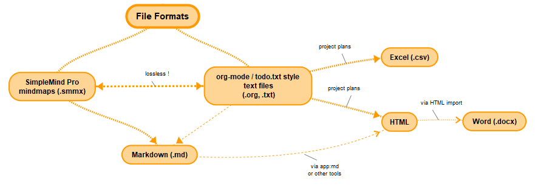

% org manual
% bsp
% 2020
>>>
02Jan2020..02Feb2020
<<<

$(var:header)

# Table of Contents
$(buf!toc)

# Introduction

`org` is a free and open source text file processor and document generator that is suitable for
  - todo-lists
  - work-breakdown-structures
  - project planning
  - time tracking
  - document outlines
  - markdown based documentation
  - simple text databases

`org` supports conversions between / to the following file formats:

`org` is loosely based on the [Emacs org-mode](https://orgmode.org/) text format (`.org` files) but can also handle todo-list style textfiles (`todo.txt`), or any mixture between these two formats.

As a standalone command line tool it works with __all__ text editors, including [Emacs](https://www.gnu.org/software/emacs/), [VIM](https://www.vim.org/), [NotePad++](https://notepad-plus-plus.org), [iA Writer](https://ia.net/writer), [Byword](https://bywordapp.com/), [Ulysses](https://ulysses.app/), [Markor](https://github.com/gsantner/markor), and many others.

In addition to text files, `org` supports lossless conversion to and from [SimpleMind Pro](https://simpleapps.eu/) `.smmx` mind maps.

# Prerequisites

`org` is written in [tks](http://tkscript.org), a free and open source scripting language, with precompiled binaries available for x64 Windows and Linux. `tks` can also be compiled for MacOS and ARM-based Linux systems.

TIP:
On Windows it is recommended (but not required) to also install [MSYS2](https://www.msys2.org/) to get access to standard *nix tools like BASH and make.
Alternatively, the [WSL 2](https://docs.microsoft.com/en-us/windows/wsl/wsl2-install) Windows Subsystem for Linux can be used (although MSYS2 has a better integration into the Windows environment, in my opinion).
========

# Command line options

>>>> cmdlinetextfmt
Convert text formatting (bold, italic, underline, strike-through, subscript, superscript)
note: without this option, all text-formatting will be passed on as-is
<<<<

>>>> ktcp-note
note: without this switch, task `clock` properties will be exported as resource `clock` properties
<<<<

>>>> tip-plain-todo
tip: Useful for converting plain todo.txt files to HTML plans
<<<<

>>>> plain-todo
Convert plain `todo.txt` or minimal `todo.org` file to HTML or markdown report.

- auto-create *default* resource
- set allocate-default to *default* (`#\+allocate-default: default`)
- set effort-default to 1h (`#\+effort-default: 1h`,  `-sde`)
- auto fold task groups (`-afg`)
- skip gantt charts (`-ssg`)
- show task titles instead of ids (`-stt`)
- derive traffic lights from task state (`-stls`)
- derive (default) document title from filename
<<<<

>>>> sc-note
note: this has the same effect as `-s -scw -ssdnr -ssptg`
<<<<

|noheader
|cols=5,20
|:-o *outputfile*    |:Set output pathname.
|                    |+The output file format is derived from the output file suffix (`.org`, `.txt`, `.md`, `.smmx`, `.csv`, `.html`)
|:-so,\-\-stdout *fmt* | Write output to stdout. *fmt* must be one of `org`, `txt`, `md`, `smmx`, `csv`, `html`.
|:-d,\-\-debug         | Enable debug output
|:-n,\-\-dry-run       | Don't actually write any output files
|:-w,\-\-warnings | Show warnings (e.g. unresolved other-project tasks)
|:-neh,\-\-no-emacs-header | Don't write emacs `\-\*\-mode` and `\#\+TODO` headers (e.g. when creating an include file)
|:-p,\-\-private       | Don't export sub-trees that are marked `private`
|:-raw,\-\-rawutf8     | Preserve `UTF-8` characters (don't convert to `CP1252`)
|:-har,\-\-html-auto-refresh | Add auto-refresh code to generated HTML page
|:-ht,\-\-html-template | Select HTML template file. See [templates](#html-templates)
|:-t,\-\-todo *level*  | Force `todo.txt`  style output for all nodes that are nested deeper than *level*
|:-g,\-\-org *level*   | Force `org-mode` style output for all nodes up to (and including) *level*
|:-psp,\-\-prefer-simplified-properties | Use simplified syntax for *special* properties like `depends`, `allocate`, ..
|:-txf,\-\-textformatting | $(buf!cmdlinetextfmt)
|:-tf,\-\-tagsfirst    | Place tags before topic title
|:-tl,\-\-tagslast     | Place tags after topic title (`org-mode` style, default)
|:-tarsc,\-\-tags-always-require-start-colon | Do not allow tags without start colon
|:-dpso,\-\-debugprintsuboutline | Print document outline to console (skip `todo.txt` style child nodes when parent is org-mode style node)
|:-pd,\-\-preferred-date *create\|finish\|scheduled\|deadline* | Sets preferred date source when exporting to `.smmx` mindmap
|:-siao,\-\-smmx-info-as-org | Convert info nodes to `.org` formatted text note when exporting to `.smmx` (default)
|:-siat,\-\-smmx-info-as-topics | Convert info nodes to actual nodes when exporting to `.smmx`
|:-f,\-\-filter *tags* | Filter out all nodes whose tags do not include at least one of the given tags (comma or colon separated list)
|:-fa,\-\-filterall *tags* | Filter out all nodes whose tags do not include all the given tags (comma or colon separated list)
|:-if,\-\-inversefilter *tags* | Blacklist all nodes whose tags include at least one of the given tags (comma or colon separated list)
|:-sf,\-\-state-filter *states* | Filter output by state(s), e.g. `TODO`, `ACTV`
|:-pf,\-\-property-filter *filter* | Add property filter, e.g. `-pf 'allocate=*bsp*'`
|:-gf,\-\-group-filter,-prj,\-\-project *filter* | Add task group / sub-project filter (id or id path), e.g. `-prj project-one` (in scheduler mode)
|:-s,\-\-schedule      | Enable scheduler mode (project plan export, `.csv` or `.html` output)
|:-sc,\-\-schedule-compact | Enable scheduler mode and generate compact HTML plan (skip parent taskgroups, show calendar weeks, ..) $(buf!sc-note)
|:-sy,\-\-schedule-years | Set maximum project duration (default = 5 years)
|:-scw,\-\-schedule-calendar-weeks | Show calendar weeks instead of per-day dates (in scheduler mode)
|:-ssdnr,\-\-schedule-skip-day-nr | Don't show day number in task cells (in scheduler mode)
|:-ssptg,\-\-schedule-skip-parent-task-groups | Don't show parent task groups (in scheduler mode)
|:-srv,\-\-schedule-resource-view | Create resource view table (in addition to project plan)
|:-now,\-\-now *date* | Override current date (default=today) (in scheduler mode)
|:-mp,\-\-multi-project | Create multi-project schedule
|:-tsgp,\-\-time-sheet-grace-period | Maximum number of calendar days until tracked working hours override planned / ideal task working hours (default=10)
|:-sbsd,\-\-sort-by-start-date | Sort report tasks by start date (in scheduler mode)
|:-ssg,\-\-schedule-skip-gantt] | Skip Gantt graph generation (in scheduler mode)
|:-ssgo,\-\-schedule-skip-gantt-overview] | Skip Gantt graph overview generation (in scheduler mode)
|:-stl,\-\-schedule-traffic-lights | Include traffic lights column in HTML plan (in scheduler mode)
|:-stls,\-\-schedule-traffic-lights-state | Derive traffic light status from working state instead of `status` property
|:-stt,\-\-schedule-task-titles | Show task titles instead of ids in HTML plan (in scheduler mode)
|:-ms,\-\-milestone *milestone_task_id* | Create schedule only for the given milestone task
|:-sde,\-\-set-default-effort-for-all-working-state-tasks | Assign [default effort](#default-effort) to all tasks with state `TODO`, `ACTV`, `TEST` or `DONE`. $(buf!tip-plain-todo)
|:-afg,\-\-autofold-task-groups | Enabling effort folding when task has sub tasks. $(buf!tip-plain-todo)
|:-nr,\-\-norisk       | Ignore all risk properties (in scheduler mode)
|:-itt,\-\-ignore-time-tracking | Ignore all time sheet entries (in scheduler mode)
|:-ttp,\-\-time-tracking-project *project-id* | Filter out all time sheet entries for projects other than *project-id*
|:-ktcp,\-\-keep-task-clock-properties | Re-export task `clock` properties $(buf!ktcp-note)
|:-docs,\-\-docs | Interpret node text as markdown and append to (HTML) output (via `app:md`)
|:-dnf,\-\-docs-no-footer | Skip footer (TOC, foot notes, w3c validator)
|:-pt,\-\-plain-todo | $(buf!plain-todo)
].cmdline

+++

# Main file formats

## Org / todo.txt (.org, .txt)

`.org` files can be converted to:

1. Org or todo.txt (`.org`, `.txt`)
2. Markdown (`.md`)
    - can then be converted to HTML, e.g. via [app:md](http://tkscript.org/md/test.html)
       - HTML can then be imported into Word or LibreOffice (`.docx`)
2. SimpleMind Pro Mindmap (`.smmx`)
3. Comma-separated-value lists (`.csv`)
    - can be opened in Microsoft Excel or LibreOffice Calc
4. HTML (`.html`)
    - can be imported into Microsoft Word or LibreOffice Writer

Supported encodings:
  - ASCII
  - CP1252 (extended ASCII, for western-european languages)
  - UTF-8 (unicode, for the rest (majority) of the world)

### Structured text files

`.org` files are structured text files. In their simplest form, they can look like a `todo.txt` file:
~~~~
- bread
- butter
- milk
~~~~
] shopping_list.txt

an alternative way (which is used by the Emacs org-mode) to write this list looks like this:
~~~~
* TODO bread
* TODO butter
* TODO milk
~~~~
] shopping_list.org

Both examples define a document with three top-level TODO nodes.

### Comments

Lines that commence with `;` will be ignored by the parser and will _not_ be exported to output files.

note: 
this is mostly useful for auto-generated files, e.g. for debug-info, or temporary, auto-calculated data (e.g. total efforts).
Please do _not_ use this for regular comments (use a `NOTE`-type node instead).
=========      

### Date formats
`org` recognizes the following date string styles:

- <2020-12-31 Thu> - *(org-mode)*
- <2020-12-31> - *(shorted org-mode)*
- 20201231 - *(integer)*
- 31Dec2020 - *(verbose)*
- 31.Dec.2020 - *(verbose with dots)*
- 31.12.2020 - *(Excel)*

### General node syntax
>>>>> gen-node-hdr
~~~~
* [<task_state>] [<tag_list>] [<priority>] node title [<effort>] [<progress>] [<tag_list>]
~~~~
] Node header (org-mode style)

~~~~
<task_state_character> [<tag_list>] [<priority>] node title [<effort>] [<progress>] [<tag_list>]
~~~~
] Node header (todo.txt style)
<<<<<<

The general node syntax looks like this:

- Node header
   1. optional task state
   2. optional tag list (before node title, enclosed in \:\:)
   3. optional priority (\[#\<prio_ABC\>\])
   4. node title
   5. optional effort estimate (in round brackets)
   6. optional progress (in square brackets)
   7. optional tag list (after node title, enclosed in \:\:)
   8. Example:
      $(buf!gen-node-hdr)
   
- Node content
   - hash tags
   - simplified properties (scheduled, allocate, depends, ..)
   - \:PROPERTIES\: (terminated with \:END\:)
   - arbitrary number of text lines
   - child nodes

Example:
~~~~
* [<task_state>] [<tag_list>] [<priority>] node title [<effort>] [<progres>] [<tag_list>]

e.g.

* DONE :ui: [#B] implement icon button (3h) [4/4]
** DONE add icon attributes to button
** DONE load icon
** DONE layout icon
** DONE render icon
~~~~
] Node layout (org-mode style)

~~~~
<task_state_character> [<tag_list>] [<priority>] node title [<effort>] [<tag_list>]

e.g.

* DONE :ui: [#B] implement icon button (3h) [4/4]
   + add icon attributes to button
   + load icon
   + layout icon
   + render icon
~~~~
] Node layout (mixed org-mode / todo.txt style)

### Text lines
A node header can be followed by an arbitrary number of text lines. Each line will be trimmed and added to the current node.

Example:
~~~~
* My Node
  Some
  arbitrary
  text
  lines.
~~~~
] text_lines.org

#### Escaped text blocks via \<\< .. \>\> {escape-text}
For text blocks containing markdown - or any other markup language - text, it may be necessary to enclose them in `<<`..`>>` tags.

Escaped text lines
 - ..will not be trimmed (leading and trailing whitespaces remain intact)
 - ..are skipped by the parser, which means that
     - property keywords are passed on as regular text (e.g. `clock:`)
     - lines may begin with *special* characters like `*`, `-`, `+`, `o`, `!`, ..

Example:
~~~~
* My Node
  <<
  * This is an escaped text line
  
  - this is a markdown list
     - with a sub list
     
  id: this will not be interpreted as a property assignment
  >>
~~~~
] escaped_text_blocks.org

### Identifiers
Each node title is converted to a globally unique task id using the same mechanism that is used to create anchors in markdown text.
This means that
 - the title is converted to lower-case
 - spaces are replaced by '-'
 - special characters like '\[\{\:' are deleted
 - numbers are appended until the id is globally unique ("-1", "-2", ..)
 
For example, the topic "My Topic Title" will be converted to the task id `my-topic-title`.

Since it is sometimes useful to override the auto-generated task id (usually when it's a sub-task), the id can be set via the 
`task_id` or `resource_id` properties, or the simplified `id` or `resource` properties:

~~~~~
* Org Spec
   ; auto-generated id, 'org-spec'

* Test
   id: org-test

* Release
   :PROPERTIES:
   :task_id: org-release
   :END:
   
   
* Staff
   * Tom
      ; auto-generated id, 'tom'
      resource

* Peter
      resource: ppa

   * Paul
      id: pkr
      resource

   * Mary
      :PROPERTIES:
      :resource_id: msh
      :END:
      
~~~~~
] identifiers.org

#### Project id
The project id is derived from the anchorfied project title. 

For example, if the project title is "My Test Project", the anchorfied project id will be "my-test-project".

The project id is used for time sheet entries (see [Time Tracking](#time-tracking)).

### States
Each document node can be assigned a task state. `org` supports the following states:

   | State  | Org Keyword | Short Form | Description
   |:-------|:------------|:-----------|:-----------
   | \<none\> | \<none\>      | `.`        | Undefined state. Often used for task-groups / headers.
   | `IDEA` | `IDEA`       | `%`        | An idea
   | `NOTE` | `NOTE`       | `!`        | A note. May contain hyper links.
   | `TODO` | `TODO`       | `-`        | A pending task.
   | `ACTV` | `ACTV`       | `o`        | A task that is currently being worked on.
   | `TEST` | `TEST`       | `t`        | A task that's almost been finished and is now being tested.
   | `DONT` | `DONT`       | `x`        | A task that you thought about, but which you ultimately rejected.
   | `IGNR` | `IGNR`       | `X`        | A canceled idea which did not make a lot of sense in the first place.
   | `DONE` | `DONE`       | `+`        | A finished task.
   | `QUES` | `QUES`       | `?`        | A topic that needs to be discussed.
   | `WAIT` | `WAIT`       | `w`        | Some thing you're waiting for (which potentially blocks further progress).
   |------------------------------------------------
   ] Task states

#### Example
~~~~~
- bread
+ butter
- milk
~~~~~
] shopping_list_task_states.org

would therefore mean that you already bought "butter" (`DONE`) but still have to go out for bread and milk (`TODO`).

#### Example (SW)

##### simplified todo.txt syntax
using the simplified todo.txt style syntax:
~~~~
+ write spec
o implementation [1/5]
   ; implementation is still work-in-progress
   + feature 1
      ; feature 1 is done
   t feature 2
      ; feature 2 is currently in testing
   w wait for 3rd party supplier to send us that new lib
   - feature 3
      ! uses 'that new lib'
   ? feature 4
      ? do we really need this ?
   x feature 5
      ! scrapped. will implement feature 3 instead.
- write documentation
   ; why write documentation when more code could be written instead :-)
% insert great idea for new feature here
~~~~
] sw_task_states_todo.org

##### org-mode syntax
the equivalent file using the org-mode syntax:
~~~~
* DONE write spec

* ACTV implementation [1/5]
   ; implementation is still work-in-progress
   
** DONE feature 1
    ; feature 1 is done
    
** TEST feature 2
    ; feature 2 is currently in testing
    
** WAIT wait for 3rd party supplier to send us that new lib

** TODO feature 3
*** NOTE uses 'that new lib'

** QUES feature 4
*** QUES do we really need this ?

** DONT feature 5
*** NOTE scrapped. will implement feature 3 instead.

* TODO write documentation
   ; why write documentation when more code could be written instead :-)
   
* IDEA insert great idea for new feature here
~~~~
] sw_task_states_orgmode.org

##### todo / org-mode mixed syntax
the equivalent file using a mixed todo/org-mode syntax:
~~~~
* DONE write spec

* ACTV implementation [1/5]
   ; implementation is still work-in-progress
   
** DONE feature 1
    ; feature 1 is done
    
** TEST feature 2
    ; feature 2 is currently in testing
    
** WAIT wait for 3rd party supplier to send us that new lib

** TODO feature 3
    ! uses 'that new lib'
    
** QUES feature 4
    ? do we really need this ?
    
** DONT feature 5
    ! scrapped. will implement feature 3 instead.
    
* TODO write documentation
   ; why write documentation when more code could be written instead :-)
   
* IDEA insert great idea for new feature here
~~~~

note: personally I prefer to use the org-mode syntax for top-level nodes, up to a nesting depth of 2 or maybe 3, then continue with the simplified todo.txt style syntax for the details

### Priorities
Each document node can be assigned a priority, ranging from A (highest) to C (lowest):
~~~~
- [#A] bread
- [#B] butter
- [#C] milk
~~~~
] shopping_list_priorities.org

tip: Assigning priority \[#A\] to tasks which have to be done *next* makes it easy to find them

### Tags
Each document node can be assigned an arbitrary list of tags:
~~~~
- :bakery: [#A] bread
- :farmersmarket: [#B] butter
- :supermarket: [#C] milk
~~~~
] shopping_list_tags.org

#### org-mode style tags
Tags may occur
  - before the (optional) priority and topic / task title
  - or after the topic / task title (emacs org-mode style)

~~~~
- [#A] bread    :bakery:
- [#B] butter   :farmersmarket:
- [#C] milk     :supermarket:
~~~~
] shopping_list_orgmode_tags.org

tip: The `-tf,--tagsfirst` command line option can be used to force placement of the tags *before* the topic/task title when an `.org` file is created.

#### Tags without start colon
When the tag list appears before the node title, the first colon can be skipped:
~~~~
- bakery:        bread
- farmersmarket: butter
- supermarket:   milk
~~~~
] tags_without_start_colon.org

note: this implicates that the node title must not contain `:` characters.
note: the command line switch `-tarsc,\-\-tags-always-requires-start-colon` disables support for this tag-list style

#### Hash Tags
Tags may also be assigned via hash tags:
~~~~
- [#A] bread
   #bakery
- [#B] butter
   #farmersmarket
- [#C] milk
   #supermarket
~~~~
] shopping_list_hash_tags.org

note: while it is possible for hash tags to contain spaces, it is _not_ recommended to do so

#### allowed-tags
The global property `allowed-tags` can be used to validate that a node only uses tags from a known list.

This is mostly useful for detecting typos and redundant tags (e.g. *hw* vs *hardware* or *textureunit* vs *texture-unit*).

### Progress
When the node header contains a string of the form `\[x/y\]` or `\[n%\]`, `org` automatically replaces it with the current progress by looking at the child node states.

In other words, it will look like this:
~~~~
* My task group [1/4]
   - subtask 1 
      - not started, yet
   + subtask 2
      ! already finished
   o subtask 3
      ! still work-in-progress
   t subtask 4
      ! currently in testing)
   ! just a note
   ? just a question
   x canceled
~~~~
] progress.org

#### Recursive progress calculation

When the parent task (-group) contains a property named `cookie_data` that is set to `todo recursive`, the progress calculation recursively iterates the entire child node tree.

Example:
~~~~
* My task group [3/6]
   :PROPERTIES:
   :cookie_data: todo recursive
   :END
   - subtask 1 
      - not started, yet
   + subtask 2
      ! already finished
      + subtask 2.1
      + subtask 2.2
   o subtask 3
      ! still work-in-progress
   t subtask 4
      ! currently in testing)
   ! just a note
   ? just a question
   x canceled
~~~~
] progress_recursive.org

note: the (rather strangely named) `cookie_data` property stems from the Emacs org-mode format and is supported due to compatibility reasons

If you don't care about Emacs org-mode compatibility, the simplified `recursive` property can be used instead: 
~~~~
* My task group [3/6]
   recursive
   - subtask 1 
      - not started, yet
   + subtask 2
      ! already finished
      + subtask 2.1
      + subtask 2.2
   o subtask 3
      ! still work-in-progress
   t subtask 4
      ! currently in testing)
   ! just a note
   ? just a question
   x canceled
~~~~
] progress_recursive_simplified.org

### Properties
Each document node can be assigned an arbitrary number of properties. 

#### User-defined properties
While some properties have special meaning (reserved property names), nodes may contain arbitrary user-defined properties which will simply be passed on as-is during document conversions:

~~~~
- bread
  :PROPERTIES:
  :energy: ~265 kcal per 100g
  :END:
  
- butter
  :PROPERTIES:
  :energy: ~717 kcal per 100g
  :fat: ~81g per 100g
  :END:
  
- milk
  :PROPERTIES:
  :energy: ~42 kcal per 100g
  :fat: ~1g per 100g
  :END:
~~~~
] user_defined_properties.org

#### Reserved properties
Some properties have special meaning:

##### Reserved scheduler properties
   | Property Name      | Description
   |:-------------------|:------------
   | task\_id           | set task id (default is anchorfied topic title)
   | resource\_id       | set resource id (default is anchorfied topic title)
   | depends            | Set task dependencies (comma separated list of task ids / task paths)
   | for                | Add task to target task dependencies (comma separated list of target task ids) ("for milestones xyz..")
   | milestone          | Tag task as milestone
   | scheduled          | Set (preferred) start date for task, task group, or sub-project.
   | fold               | Sum efforts and don't export child nodes as separate tasks
   | org-fold           | alias for 'fold'
   | private            | Sum efforts but don't export child nodes (when combined with `-p,\-\-private` command line option)
   | org-private        | alias for 'private'
   | ignore             | Ignore child nodes entirely
   | org-ignore         | alias for 'ignore'
   | effort             | Set task effort (e.g. 8h, 1d, 2w, 3m, or 0.5y) (1d=8h, 1w=40h, 1m=160h, 1y=260d or 2080h)
   | effortrisk         | Set task effort risk (e.g. 1.2 or 20%)
   | duration           | Set task duration (e.g. 4h, 1d, 2w, 3m, or 0.5y) (1d=24h, 1w=168h, 1m=720h, 1y=365d or 8760h)
   | durationrisk       | Set task duration risk (e.g. 1.2 or 20%)
   | allocate           | Allocate resource(s) to a task
   | workinghours       | Set resource working hours
   | no-public-holidays | Excludes a resource from all public holidays
   | vacation           | Add resource period of unavailability (due to vacation), *\<startdate\>* [- *\<enddate\>*]
   | sickness           | Add resource period of unavailability (due to sickness)
   | other-project      | Add resource period of unavailability (due to other projects)
   |------------------------------
   ] Reserved scheduler property names

##### Reserved org properties

The following properties are used (usually auto-generated) when converting from `org` to `smmx`:

   | Property Name                 | Description
   |:------------------------------|:------------
   | org-separator-style           | ASCII-separator style. minus, equal, asterisk, underscore, plus, tilde, dot, hash, colon, circumflex, aright, aleft.
   | org-separator-caption         | ASCII-separator caption (after separator chars)
   | org-layout                    | list or top-down
   | org-prio                      | 1..3 => A..C
   | org-tags                      | node tags
   | org-empty-line-after-node-hdr | force empty line after node header when converting back to `.org`
   | org-empty-line-after-node     | force empty line after node when converting back to `.org`
   | start                         | start date (same as `SCHEDULED:` simplified property)
   | id                            | task or resource id
   | smmx-calendar-date-type       | calendar date source (create, finish, scheduled, deadline)
   | cookie_data                   | when set to `recursive`, enable recursive progress calculation (traverse child nodes)
   |                               |  (emacs org-mode compatibility. also see simplified `recursive` property below)
   |----------------------------------------------
   ] Reserved org property names

##### Reserved smmx mindmap properties

The following properties are used (usually auto-generated) when converting from `.smmx` to `.org`:

   | Property Name             | Description
   |:--------------------------|:------------
   | was-main                  | topic was free-floating node in mindmap
   | smmx-position             | node or callout coordinate
   | smmx-palette              | color palette
   | smmx-colorinfo            | color selection
   | smmx-icon                 | icon name
   | smmx-text-style           | text style flags ('bius', bold italic, underline, strikethrough)
   | smmx-font-scale           | font size (2.4 = 24pt)
   | smmx-list                 | sub-tree uses list layout
   | smmx-list-md              | sub-tree uses markdown list layout
   | smmx-hull-visible         | node grouping
   | smmx-collapsed            | collapse child nodes
   | hide                      | shortcut for smmx-collapsed
   | smmx-fill-color           | rgb24 html-style fill color, e.g. #ccc
   | smmx-border-style         | sbsNone, sbsHalfRound, sbsDropRoundRect, sbsRoundRect
   | smmx-border-width         | border width
   | smmx-stroke-style         | solid, dash-s, dash-m, dash-l
   | smmx-stroke-color         | rgb24 html-style fill color, e.g. #ccc
   | smmx-embedded-image-name  | image embedded in topic box
   | smmx-embedded-image-scale | scaling factor (1.0=unscaled)
   | smmx-image-name           | callout image or external image preview thumbnail
   | smmx-image-thumbnail      | callout image preview thumbnail
   | smmx-image-url            | external image URL
   | smmx-relation             | relation (with target node)
   | smmx-parent-relation      | relation (with parent node)
   |------------------------------
   ] Reserved scheduler property names

##### Simplified properties
The following simplified properties can be set __without__ using the `:PROPERTIES:` syntax:

   | Property Name      | Description
   |:-------------------|:------------
   | id                 | Set task or resource id (default is anchorfied topic title)
   | resource           | Tag node as resource (with optional resource id when followed by '\:')
   | for                | Add task to target task dependencies (comma separated list of target task ids) ("for milestones xyz..")
   | depends            | Set task dependencies (comma separated list of task ids)
   | milestone          | Tag task as milestone
   | recursive          | Enable recursive progress calculation (traverse child nodes)
   | scheduled          | Set preferred start date for tasks, task-groups, or sub-projects (standard org-mode property)
   | deadline           | Set deadline date (parsed but currently unused. this is a standard org-mode property)
   | created            | Set the date when a task was first added
   | finished           | Set the date when a task was completed (scheduler then ignores the task if it's before the `start-date`)
   | fold               | Sum efforts and don't export child nodes as separate tasks
   | private            | Sum efforts but don't export child nodes (when combined with `-p,\-\-private` command line option)
   | ignore             | Ignore child nodes entirely
   | effort             | Set task effort (e.g. 8h, 1d, 2w, 3m, or 0.5y) (1d=8h, 1w=40h, 1m=160h, 1y=260d or 2080h)
   | effortrisk         | Set task effort risk (e.g. 1.2 or 20%)
   | duration           | Set task duration (e.g. 4h, 1d, 2w, 3m, or 0.5y) (1d=24h, 1w=168h, 1m=720h, 1y=365d or 8760h)
   | durationrisk       | Set task duration risk (e.g. 1.2 or 20%)
   | allocate           | Allocate resource(s) to a task
   | workinghours       | Set resource working hours
   | no-public-holidays | Excludes a resource from all public holidays
   | vacation           | Add resource period of unavailability (due to vacation)
   | sickness           | Add resource period of unavailability (due to sickness)
   | other-project      | Add resource period of unavailability (due to other projects)
   | clock              | Add time sheet entry
   |----------------------------------------------------------------------------------
   ] Simplified properties

###### Example
~~~~~~
* ACTV write documentation
          id: org_docs
    allocate: me 
      effort: 2d
        risk: 50%
   scheduled: <2020-01-22 Wed>
   
* me
   resource
   workinghours: mo-fr 19-22, sat-sun 10:00-17:00
   vacation: <2020-07-03 Fri> - <2020-08-09 Sun>
     ; if only
~~~~~~
] simplified_properties.org

### Global Properties

Lines starting with `#+` are interpreted as global properties.

For example, the document title and project start date can be set via
~~~~
#+title:      My Project
#+start-date: 23Jan2020
~~~~

>>>> def-todo-state
The default todo state is
~~~
#+TODO: IDEA TODO ACTV TEST DONT IGNR NOTE QUES WAIT | DONE
~~~
It will automatically be prepended to each exported `.org` file.
<<<<<

The following global properties are supported:

   | Global Property Name      | Description
   |:--------------------------|:------------
   | title                     | document title
   | start-date                | project start date (for scheduler)
   | todo                      | org-mode todo state configuration
   |                           | note: $(buf!def-todo-state)
   | allowed-tags              | comma separated list of allowed tags
   | schedule-tags             | comma separated list of tags displayed in scheduler output
   | startup                   | emacs startup-options (e.g. `showeverything`, `showall`)
   | smmx-style-key            | Mindmap graphics style, e.g. `system.colors-on-black-palette`, `system.gray-scale`
   | smmx-info-position        | position of `info` node
   | smmx-root-position        | position of `root` node
   |------------------------------
   ] Global property names
   

#### Simplified Global Properties
For reasons of convenience, the following simplified global property names are supported as well:

   | Simplified Global Property Name    | Description
   |:-----------------------------------|:------------
   | title                              | document title
   | start-date                         | project start date (for scheduler)
   | allowed-tags                       | comma separated list of allowed tags
   | schedule-tags                      | comma separated list of tags displayed in scheduler output
   | public-holiday                     | add public holiday (vacation time for all resources), *\<date\>* [- *\<enddate\>*]
   ] Simplified global properties

### Directives

#### Include files
The `#+include:` directive can be used to insert other (text-)files at any point in the document:

~~~~
     title: test project
start-date: <2020-02-03 Mon>

#+include: staff.org

- First task (1d)
   allocate: peter
   #+include: first_task.org
   
- Second task (2d)
   allocate: paul
   #+include: second_task.org

- Third task (5d)
   allocate: mary
   #+include: third_task.org
~~~~
].include_test_nested.org

NOTE: Each line of an included file will be indentend by the number of spaces before the `#+include` directive.

#### Default resource allocation
The `#+allocate-default:` directive can be used to set the default task resource allocation:

~~~~
#+allocate-default: me

* me
  resource
  
* Task 1 (1d)
* Task 2 (4d)
~~~~
] allocate_default.org

#### Default effort
The `#+effort-default:` directive can be used to set the default task effort:

~~~~
#+effort-default: 2d

* Task 1
* Task 2
~~~~
] effort_default.org

note: this is mostly useful during the early stages of a project when a work breakdown structure starts to form but efforts have not been estimated, yet

### Links

Links in the body of a node (i.e. in the text lines that directly follow the node header) are not parsed at all (they are passed on as-is).

However, if the first child node of a node is an info note, the parser will check if the info topic is a link, and if it is, attach it to the parent mindmap node during `.smmx` conversion.

However (again), if a node contains several (successive) child nodes whose topics can be converted to links, these will be treated as a link **list**, and the first child node link will __not__ be attached to the parent node.

It's probably easier to understand by looking at the following examples:

~~~~~~
* Build flux capacitor
   ! see https://example.com/research_note.html
~~~~~~
] Single link (will be attached to parent node)

~~~~~
* A list of rather useless web sites
   ! http://www.rrrgggbbb.com
   ! http://endless.horse
   ! http://ihasabucket.com
   ! https://pointerpointer.com
   ! http://chihuahuaspin.com
   ! http://www.blankwindows.com
   ! http://www.hackertyper.com
   ! http://notdayoftheweek.com
   ! http://pixelsfighting.com
   ! http://buildshruggie.com
~~~~~
] Link list (will not be attached to parent node)

#### Link formats
The following link formats are recognized by the `org` parser:
  - [Setext](https://en.wikipedia.org/wiki/Setext) / [Markdown](https://en.wikipedia.org/wiki/Markdown) / Line-wrap protected links:
     - \<http://example.com/external_file.org\>
        - or other protocols, the parser looks for `\://`
     - \<file.org\>
     - \<../path/to/file.org\>
     - \</path/to/file.org\>
     - \<c:/path/to/file.org\>
  - [Wiki](https://en.wikipedia.org/wiki/Help:Link) links:
     - \[\[other_file.org\]\]
     - \[\[file.org\]\]
     - \[\[../path/to/file.org\]\]
     - \[\[/path/to/file.org\]\]
     - \[\[c:/path/to/file.org\]\]
     - \[\[http://example.com/external_file.org\]\]
           - or other protocols, the parser looks for `\://`
  - ./file.org
  - ../path/to/file.org
  - c:/path/to/file.org
  - http://example.com/external_file.org
     - or other protocols, the parser looks for `\://`
     
#### Automatic file suffix replacement
When converting between `.smmx` and `.org` files, the suffixes of linked files will automatically replaced.

I.e. when converting to `.org`, `.smmx` file suffixes will be replaced by `.org`, and vice versa.

### Text Callouts
Text callouts are used to store short and comprehensive descriptions of the node's topic.

~~~~
* My topic
  \> This is a brief description of my topic.
  \> This is the second line of the description.
~~~~
] text_callout.org

note: Multiple text callouts will be interpreted as separate lines of a single multi-line callout.

tip: When an `.org` file is converted to an `.smmx` mind map, text callouts become actual callout boxes (e.g. speech bubbles).

tip: When an `.org` file is converted to a `.csv` or `.html` project plan, text callouts will be converted to comment fields.

+++

## SimpleMind Pro Mindmap (.smmx)

[SimpleMind Pro](https://simpleapps.eu/) is a (very affordable) mind mapping tool that is available for Windows, Mac, iOS, and Android.

`org` supports lossless conversion between text files and mind maps, in *both directions*.

Meta data not supported by the `.smmx` mindmap format will be stored as a mindmap note that is encoded in `org` format,
while meta data that is not supported by the `.org` format will be stored as `smmx-` properties.

`.smmx` files can be converted to:

1. Org or todo.txt (`.org`, `.txt`)
2. Markdown (`.md`)
    - can then be converted to HTML via `app:md`
       - HTML can then be imported into Word or LibreOffice (`.docx`)
3. SimpleMind Pro Mindmap (`.smmx`)

### Why mindmaps

Mind-mapping is a useful technique for brainstorming structured ideas or document outlines, favoured especially by [visual thinkers](https://knowwithoutborders.org/visual-thinking-with-mind-mapping/).

`org`'s ability to transform mindmaps into structured text documents (for further editing), and even back to mindmaps (for adding new ideas) makes these two a very useful combination for editing documents on both desktop on mobile platforms (like tablets and smartphones).

### Conversion features
`org` supports all mindmap features including
  - relations between mindmap nodes
     - parent relation
     - relations between any two nodes
  - links
     - local file system
     - URLs
     - cloud documents
     - (optional) conversion between `.smmx` and `.org` file suffixes
  - icons
     - custom icons
     - automatic icon selection depending on task state, priority, or resource description
        - vice versa, the icon is converted back to a task state (and priority) when the mindmap is converted to an `.org` file
  - images
     - scaling
     - rotation
     - thumbnails
  - checkboxes and rollup-progress
  - calendar date
  - text callouts (for nodes and relations)
  - image callouts
  - top-down, list, and freeform layouts
  - text formatting (bold, italic, underline, strike-through)
  - position, style, shape and color info

### Images
The `.smmx` files used by SimpleMind Pro are basically `.zip` files that store XML and PNG data.

When converting to `.org`, images will automatically be extracted from the mindmap and stored in the local files system (relative to the `.org` output file). 

If a sub-directory named `images/` exists in the output path, images will be placed there. Otherwise they will be stored in the same directory as the `.org` output file.

Vice versa, when an `.org` file is converted to `.smmx`, PNG images will be copied from the local file system to the `.smmx` archive.

# Scheduler
The scheduler is enabled via the `-s,--schedule` command line switch.

Prerequisites:
  - each task node with a TODO, ACTV, TEST, or DONE state must be assigned
     - an estimated effort (`effort`)
     - a resource (`allocate`)
  - there must be at least one milestone task (`milestone`)
  - the project must have a start date (`start-date` global property)

## Output formats
The scheduler can produce the following output formats:

>>>> schedule-out-csv-note
tip: Can be converted to simple Gantt graphs via the `sim_city.xlsx` template file.
<<<<

>>>> schedule-out-html-no-gantt
tip: The Gantt graph can be disabled with the `-ssg,--schedule-skip-gantt` command line option
<<<<

>>>> schedule-out-html-tags
tip: The displayed tags can be limited via the `schedule-tags` global property
<<<<

   | suffix | Name     | Description
   |:-------|:---------|:-----------------
   |        | Console  | Console debug output (`-d` command line option)
   | .md    | Markdown | Markdown tables
   | .csv   | Excel    | Excel comma-separated-value lists
   |        |          |+ $(buf!schedule-out-csv-note)
   | .html  | HTML     | HTML tables with Gantt graph(s)
   |        |          |+ $(buf!schedule-out-html-no-gantt) $(buf!schedule-out-html-tags)
   ---------------------------------------
   ] Scheduler output formats

### Example
~~~~
$ tks app:org -s myproject.org -o myproject.html
~~~~

### Custom CSS files
When a CSS file with the same name as the input or output file but with suffix `.css` exists in the input or output directory, it will override the built-in style sheet.

~~~~
$ tks app:org -s org_in/myproject.org -o html_out/myproject.html
~~~~
will look for CSS files `org_in/myproject.css`, `html_out/myproject.css`, and `html_plan.css` (in current working directory).

note: the CSS file content will be copied into the generated HTML document

## Resources
Each task that is supposed to be included in a schedule needs to be assigned an effort, and a resource.

Resource are defined by via the `resource` / `resource_id` property:

~~~~~
* Peter Parker
   ; Peter becomes a resource with the id 'peter-parker'
   resource

* Paul
   ; Paul becomes a resource with the id 'pkr'
   id: pkr
   resource

* Mary
   ; Mary becomes a resource with the id 'msh'
   resource: msh

* Bruce
   ; Bruce becomes a resource with the id 'batman'
   :PROPERTIES:
   :resource_id: batman
   :END
~~~~~~
] Resource definitions

### Multiple resource assignments
When multiple resources are assigned to a task, the scheduler will try to utilize all of them but if a resource is blocked or vacant, it may only utilize some of the resources.

tip: It is always better to assign *only one* resource to a task and split larger tasks into sub-tasks when necessary

## Working hours
Each resource can be limited to a certain set of days and hours via the `workinghours` property.

`org` recognizes the following string styles:

- mo-fr
- mon-fri
- mo-fr, 9:00-17:00
- mo-fr, 9-5
- mo-fr, 23-5
- mo-fr, 8h
- mon-tue 8h, wed off, thu 9h, fr 7h
- mon-tue 8-13, wed 6h, thu 8:00-17:00, fri off

## Example
~~~~~
* Peter
   resource
   workinghours: mo-thu 8:00-16:30, fri off
~~~~~
] Working hours

### Out of Office periods
The scheduler will not assign resources during out of office periods. This includes vacations, public holidays, sickness, and other projects.

#### Vacation
The `vacation` property can be used to add one or many holidays to a resource.
It may occur multiple times.
~~~~~
* Peter
   resource
   vacation: <2020-01-28 Tue> - <2020-02-14 Fri>
   vacation: <2020-07-09 Thu> - <2020-07-10 Fri>
~~~~~
] Vacations

##### Public holidays
The `public-holiday` global property can be used to define vacation periods for *all* resources. 
It may occur multiple times.
~~~~~
; x-mas
#+public-holiday: <2020-12-25 Fri> - <2020-12-26 Sat>

* Peter
   resource
   
* Paul
   resource
   
* Mary
   resource
~~~~~
] Public holidays

###### no-public-holidays
The `no-public-holidays` property can be used to exclude a resource from all public holidays (by default).

Please use the `vacation` or `other-project` property to re-add any subset of the globally defined public holidays.
~~~~~
#+public-holiday: <2020-12-25 Fri> - <2020-12-26 Sat>

* Peter
   resource
   ; Peter is on holiday on the first day of x-mas but has to work on the second one
   no-public-holidays
   vacation: <2020-20-25>
~~~~~
] Working on a public holiday

#### Sickness
The `sickness` property can be used to exclude a resource from being allocated within the given period.
It may occur multiple times.
~~~~~
* Paul
   resource
   sickness: 27.01.2020
~~~~~
] Sick day

#### Other projects
The `other-project` property can be used to exclude a resource from being allocated within the given period (because (s)he's busy with other projects).
It may occur multiple times.
~~~~~
* Mary
   resource
   other-project: <2020-05-25 Mon> - <2020-05-29 Fri>
~~~~~
] Other projects

## Task dependencies

### Parallel sub tasks
A task always depends on its child- / sub tasks:
~~~~
* Vacation
   - Book hotel
   - Pack suitcase
   - Apply for a passport
~~~~
] Parallel sub task dependencies

note:
Sub tasks on the same nesting level are considered *parallel* tasks by default.
Parallel tasks can be assigned to different resources who can then work on them simultaneously.
====

### Serial sub tasks
The `ordered` property is used to declare that all (direct) sub tasks have to be finished in the order of appearance:
~~~~~~
     title: Ordered Schedule
start-date: <2020-02-03 Mon>

\#+include: staff.org

* Build a house
   ordered
   - buy property (1d)
      allocate: peter
   - foundation (2d)
      allocate: paul
   - rough framing (3d)
      allocate: mary
   - plumbing (4d)
      allocate: paul
   - electrical installation (5d)
      allocate: mary
   - insulation
      ; the following two tasks can be done in parallel
      - insulate walls (3d)
         allocate: peter
      - insulate roof (3d)
         allocate: mary
   - finish interior (7d)
      allocate: paul

* Milestones

** Move in
   milestone
   depends: build-a-house
~~~~~~
] Serial (ordered) sub task dependencies

This results in the following schedule:

   | Task                    | Effort (h) | Allocate   | Start      | End
   |:------------------------|:-----------|:-----------|:-----------|:----------
   | buy property            | 8          | peter      | 17.02.2020 | 18.02.2020
   | foundation              | 16         | paul       | 18.02.2020 | 19.02.2020
   | rough framing           | 24         | mary       | 20.02.2020 | 25.02.2020
   | plumbing                | 32         | paul       | 16.03.2020 | 19.03.2020
   | electrical installation | 40         | mary       | 23.03.2020 | 31.03.2020
   | insulate walls          | 24         | peter      | 01.04.2020 | 07.04.2020
   | insulate roof           | 24         | mary       | 02.04.2020 | 07.04.2020
   | finish interior         | 56         | paul       | 07.04.2020 | 15.04.2020
   | Move in                 |            |            | 15.04.2020 | 15.04.2020
   -----------------------------------------------------------------------------
   ] Ordered schedule output (considering vacations and part-time working hours)

### Explicit dependencies

#### depends
The `depends` property can be used to define dependencies to any other tasks:

~~~~~
* Wood
   - cut down another tree
* Nails
   - go to the hardware store
* Rope
   - plait some straw
* Tree House
   depends: wood, nails, rope
~~~~~
] Explicit task dependencies (depends)

caution: The dependencies apply to the **current node only**. If all sub-tasks shall depend on the given task(s), the `after` property must be used instead.

#### for
The `for` property can be used to add the current task to the list of dependencies of another task:

~~~~~
* Wood
   for: tree-house
   - cut down another tree
* Nails
   for: tree-house
   - go to the hardware store
* Rope
   for: tree-house
   - plait some straw
* Tree House
~~~~~
] Explicit task dependencies (for)

#### after (inherit)
The `after` property is used to specify the dependencies for the current node (task), and also **inherit them to all sub-tasks**:

~~~~
* Spec (1d)

* Implementation
  after: spec
  fold

  - module 1 (3d)
  - module 2 (5d)
~~~~~
] Inherited task dependencies (after)

## Task start and end dates
Each task is assigned a start and end date. 

The start date is set when the first resource starts working on the task (or is planned to do so).

The end date is set 
 - to the day on which all estimated working hours have been consumed (`effort` property)
 - or to the `finished` date, in case the task was completed earlier than expected
 - or to the day on which the last resource stopped worked on the task (if the task state is `DONE`)
 
note: The `finished` property __must__ be set for all tasks which have been completed before the project even started

### Preferred start date (scheduled property)
The `scheduled:` property can be used to set a preferred start date for a task, task group, or sub-project.

Example:
~~~~
* My Sub Project
   scheduled: <2020-05-04 Mon>
~~~~
] preferred_start_date.org

important: when no resources could be allocated on the preferred start date, the date will be shifted as required

### Early task starts
As soon as a resource starts working on a task (which may even depend on another task that has not been completed, yet),
the task start date will be pushed forward. 
However, the task will remain idle until its scheduled start date, i.e. the scheduler will not consume any further resource work hours until the scheduled date.

## Milestones
The scheduler requires at least one milestone. It will then look at all the dependent tasks to generate the schedule.

~~~~
; assign all following tasks to Peter
allocate-default: peter

* Peter
   resource

* Soup (1h)

* Main Course (2h)

* Dessert (0.5)

* Supper
   milestone
   depends: soup, main-course, dessert
~~~~~
] Milestone example

Please take a look at the `sim_city.org` example project for a more comprehensive example.

TIP: Tasks that were already finished before the project `start-date` will be ignored by the scheduler

## Folding
In order to keep the total number of tasks within a reasonable limit, micro-tasks can be folded into a parent task via the `fold` keyword:
~~~~
* Task 1
   ; the 'fold' keyword will make the effort of this task the sum of all sub-tasks
   ; i.e. "task-1" will require a total effort of (0.5+1+3+2) = 6.5h
   fold
   - micro sub-task1 (0.5h)
   - micro sub-task2 (1h)
   - micro sub-task3 (3h)
   - micro sub-task4 (2h)
~~~~
] fold_micro_tasks.org

note: time sheet entries must reference the parent task, no the the sub-tasks

### private
The `private` keyword works similar to the `fold` keyword except that when the `.org` file is exported to a new `.org` file, private tasks will not be written to the new file when the `-p,\-\-private` command line option is used.

### ignore
The `ignore` keyword will cause all sub-tasks to be ignored during scheduling.

tip: a similar effect can be achieved by placing the sub-tasks in a sub-node that does not have a work state (`TODO`, `ACTV`, `TEST`, `DONE`)

## Multiple (sub-)projects
The `-mp,\-\-multi-project` switch is used to enable multi-project scheduling mode.

A multi-project consists of one or many sub-projects.

A (sub-)project is basically a task group that creates a namespace for its contained tasks.

The `scheduled:` keyword can be used to specify a start-date for a sub-project.
note: the actual start-date is shifted when no resources could be allocated for the specified date

When resolving task ids, a task's parent task-groups (including the sub-project task group) have priority over other sub-project's task.

In multi-project scheduling mode, all milestones will be scheduled at once.

# Time Tracking
Without tracking the actual hours spent on each task, the scheduler can only assume an ideal / theoretical resource availability. 
In reality, resources often work on multiple projects at once, or get side-tracked by unforseen tasks.

Time tracking can (and should) be used to document the actual number of daily working hours spent on each task.

(todo) implement+document privacy features (strip comments, list other project tasks as "other"), rewrite/filter time sheets to generate public sheet from private data

## Syntax
An arbitrary number of time sheet entries can be attached to each resource:

~~~~~
* Peter
   resource

   ; date specifies first day of the week (usually a monday)
   week 27Jan2020:
     timetracking.task-1  4 5 6 7   7   insert arbitrary comment here
     timetracking.task-2  0 1 1 1   0
     admin                2 0 0 0   0
     support              2 3 1 0.5 1
~~~~~
] timetracking.org

### week
A time sheet entry starts with the keyword `week`, followed by the date of the first day of the week (see [Date Formats](#date-formats)).

The following lines of the time sheet entry must be indented, i.e. when the entry header starts with 3 spaces, the task lines must use an indent of 4 spaces or more.

Each task line starts with the project id, followed by a `.`, followed by the task id.

note: while the project id is actually optional (the current project id will automatically be filled in if it's missing), it is highly recommended to prefix all task ids with explicit project ids to avoid any ambiguities.

The remaining columns list the number of hours spent on each week day.

When a column is neither an integer or floating-point number, nor starts with `-` or `x` (aliases for 0), it is assumed to be a comment that terminates the task line.

>>>>task-path-tip
~~~~
module1.spec
~~~~
<<<<

tip: instead of a unique task-id it is also possible to use an path pattern that consists of anchorfied task titles, separated by `.` characters. Example: $(buf!task-path-tip) 

### clock
Alternatively, daily time sheet entries can be entered as follows:
~~~~~
* Peter
   resource
   
   clock: timetracking.task-1  27Jan2020  4    insert arbitrary comment here
   clock: admin                27Jan2020  2
   clock: support              27Jan2020  2
   clock: timetracking.task-1  28Jan2020  5
   clock: timetracking.task-2  28Jan2020  1
   clock: support              28Jan2020  3
   clock: timetracking.task-1  29Jan2020  6
   clock: timetracking.task-2  29Jan2020  1
   clock: support              29Jan2020  1
   clock: timetracking.task-1  30Jan2020  7
   clock: timetracking.task-2  30Jan2020  1
   clock: support              30Jan2020  0.5
   clock: timetracking.task-1  31Jan2020  7
   clock: support              31Jan2020  1
~~~~~
] timetracking_clock.org

note: This syntax is more suitable for auto-generated `clock` entries. It is used when re-exporting resources to `org` format.

### Clock entries in task
Instead of listing the time tracked tasks in a resource definition, it is also possible to clock time within a task definition.
The prerequisite for this is that the task is allocated to exactly one resource.

~~~~~
* Peter
   resource

* Task 1
   allocate: peter
   clock: 27Jan2020 4h
~~~~~
] timetracking_per_task.org

note: by default, all `clock` entries (both resource and task) will be exported as resource properties
note: the `-ktcp,\-\-keep-task-clock-properties` command line switch can be used to keep the `clock` entries in their original locations (i.e. in the task definition).

todo: support Emacs org-mode `:LOGBOOK:` entries

## Now

When a project plan / agenda is generated, the scheduler compares project days to the actual current date (now).

When a project day (day 1 = project start) is in the past and there are no time sheet entries for that particular day and task, the scheduler assumes that zero working hours have been spent on the task.

### Time sheet grace period
The `-tsgp,\-\-time-sheet-grace-period` command line option controls how many days are allowed to pass until the scheduler assumes zero working hours instead of the ideal, maximum resource availability (according to the resource\`s `workinghours`, `vacation`, and `sickness` properties).

note:The default setting is 10 days.

## Privacy
The command line option `-ttp,\-\-time-tracking-project` can be used to filter time sheet entries by a specific project-id.

Example:
~~~~~
$ tks app:org -psp -neh -ttp sim-city tests_org/private_resource.org -o out_org/public_resource.org
~~~~~
] Creating a public resource include file, filtered for the "sim-city" project

tip: Re-exported time sheet entries will always be stripped off their comments (which may contain additional working hour details)

# Documentation
The `-docs,\-\-docs` command line switch enables the document generator which interprets a node's text lines as [markdown](https://daringfireball.net/projects/markdown/) and converts them to HTML.

In scheduler mode, the resulting HTML document will be appended to the generated project plan.

  
    
note: The output format must be either HTML or markdown (output file name suffixes `.html` or `.md`).

caution: 
Generating HTML documents from `.org` via the `\-\-docs` switch results in a different output than without the switch.
The default conversion creates a mind-map file first, converts that to `.md`, then to `.html`.
===

tip: The markdown-to-HTML conversion uses [app\:md](http://tkscript.org/md/test.html), which supports many extensions not found in [common markdown](https://commonmark.org/) or [GIT flavoured markdown](https://github.github.com/gfm/).

tip:
The inlined markdown text can include other pre-generated markdown or HTML content, or reference pre-generated documents and images. 
It is recommended to use a [Makefile](https://www.gnu.org/software/make/) (or similar build tool) to generated the content as required (i.e. to avoid redundant content generation).
===

  
Example:
~~~~
tks app:org --docs tests_org/markdown_docs.org -o out_html/markdown_docs.html
~~~~
] Generating .html documentation from .org file

# Customizable HTML templates {html-templates}
When generating HTML documents, `org` uses a built-in template file (`html_templates/builtin_template.html`) by default.

This can be overridden via the `-ht,\-\-html-template` command line option.

The following variables will be replaced in the template file:

     | Var              | Description
     |:-----------------|:---------------------------------------------------
     | `$(TITLE)`       | Document title
     | `$(META)`        | Additional meta tags (like auto-refresh)
     | `$(CSS)`         | Stylesheet data
     | `$(PLAN)`        | Project plan div
     | `$(RV)`          | Resource view div
     | `$(DOCS)`        | Documentation div
     | `$(W3VALIDATOR)` | W3C validator icon+link (unless skipped via `-dnf`)
     ------------------------------------------------------------------------
     ] HTML template variables

# License
`org` and `md` are distributed under terms of the [MIT](https://opensource.org/licenses/MIT) license.

~~~~~
Copyright 2020 bsp

Permission is hereby granted, free of charge, to any person obtaining a copy of this software and associated documentation files (the "Software"), to deal in the Software without restriction, including without limitation the rights to use, copy, modify, merge, publish, distribute, sublicense, and/or sell copies of the Software, and to permit persons to whom the Software is furnished to do so, subject to the following conditions:

The above copyright notice and this permission notice shall be included in all copies or substantial portions of the Software.

THE SOFTWARE IS PROVIDED "AS IS", WITHOUT WARRANTY OF ANY KIND, EXPRESS OR IMPLIED, INCLUDING BUT NOT LIMITED TO THE WARRANTIES OF MERCHANTABILITY, FITNESS FOR A PARTICULAR PURPOSE AND NONINFRINGEMENT. IN NO EVENT SHALL THE AUTHORS OR COPYRIGHT HOLDERS BE LIABLE FOR ANY CLAIM, DAMAGES OR OTHER LIABILITY, WHETHER IN AN ACTION OF CONTRACT, TORT OR OTHERWISE, ARISING FROM, OUT OF OR IN CONNECTION WITH THE SOFTWARE OR THE USE OR OTHER DEALINGS IN THE SOFTWARE.
~~~~~

# Downloads
The latest versions of `org` and `md` can be downloaded here:
 - [org.7z](../files/x64/org.7z)
 - [md.7z](../files/x64/md.7z)

note: `org.tkx` and `md.tkx` should be installed to the tks `applications/` directory so they can be invoked via `tks app:org` and `tks app:md`

# References

- [Emacs org-mode](https://orgmode.org/) - Home of the original Emacs org-mode (FOSS, cross platform)
- [tks](http://tkscript.org) - Home of the TkScript language (FOSS, cross platform)
- [app:md](http://tkscript.org/md/test.html) - the TkScript Markdown-to-HTML converter (FOSS, cross platform)
- Text editors:
   - [Emacs](https://www.gnu.org/software/emacs/) - Emacs (the best :-)) (FOSS, cross platform)
   - [VIM](https://www.vim.org/) - VI Improved (FOSS, cross platform)
   - [NotePad++](https://notepad-plus-plus.org) - Free and Open Source (__FOSS__) text editor for Windows
   - [iA Writer](https://ia.net/writer) - For Mac and iOS ("Plain text. Full ownership. Total focus"). Supports Markdown.
   - [Byword](https://bywordapp.com/) - For Mac and iOS ("Markdown app for writing in plain text efficiently")
   - [Ulysses](https://ulysses.app/) - For Mac and iOS ("The Ultimate Writing App") (downside: expensive / subscription only)
   - [Markor](https://github.com/gsantner/markor) - For Android ("Simple and lightweight, supporting Markdown and todo.txt"). FOSS.
- [WSL 2](https://docs.microsoft.com/en-us/windows/wsl/wsl2-install) - Windows Subsystem for Linux
- [MSYS2](https://www.msys2.org/) - a software distro and building platform for Windows (FOSS)

$(buf!footnote)
$(buf!w3validator)

Document created on $(var:localdatetime)
].create
