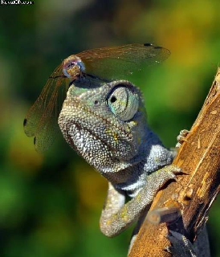

% images
% smmx_to_markdown
% 05-Jan-2020

$(var:header)

# Table of Contents
$(buf!toc)

images
======

## image on top of node (upload-to-cloud)

## image include-in-mindmap-file

## linked image (Link to Source)

   - first list item
   - list item with an image
     

## another included image

## mindmap
Date: 05-01-2020

**Link**: [../index.html](../index.html) *(cloud smmx)*

    this is a callout note
    this is the second line of the callout note

this is a note.
this is the second line of the note

this is the fourth line of the note.

image in topic box (via "add embedded image")
=============================================

$(buf!footnote)
$(buf!w3validator)

Document created on $(var:localdatetime)
].create
